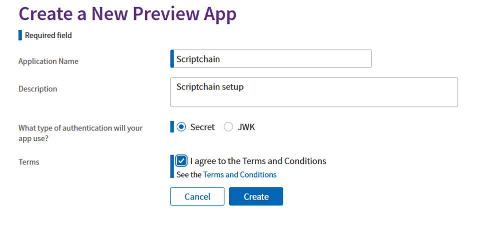
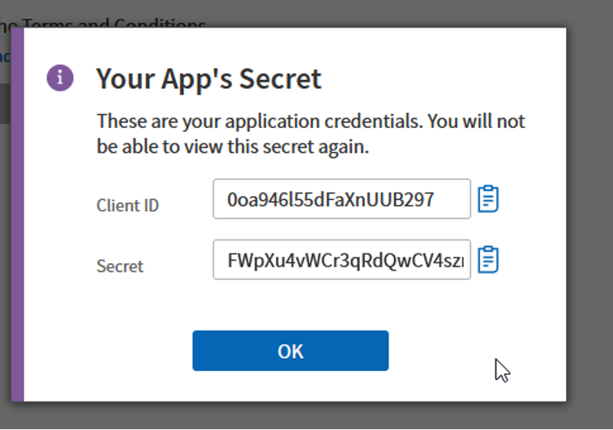
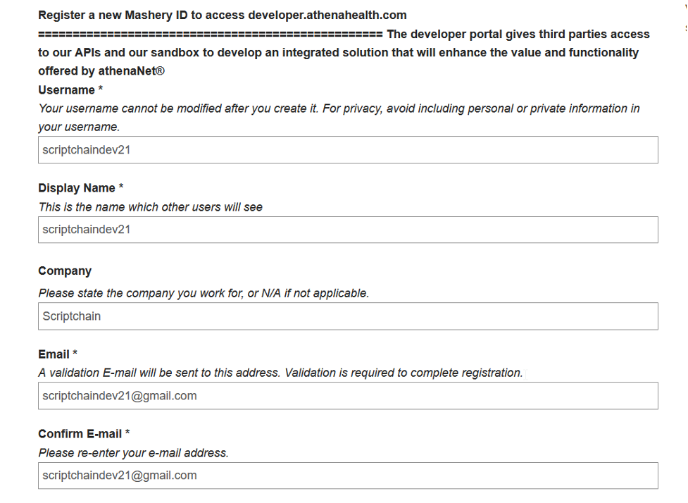
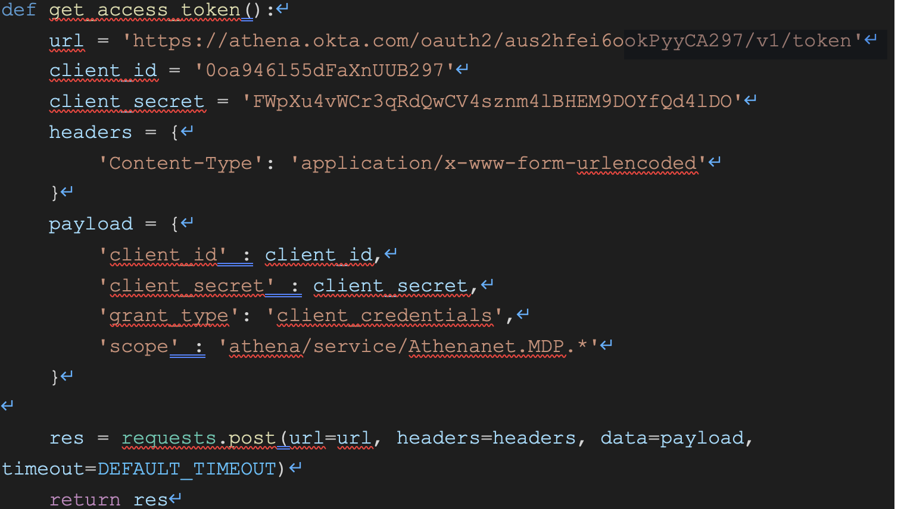

**Athena Interface and App Setup**

**Step 1:** 

**Step 2:** 

**Client id: 0oa946l55dFaXnUUB297**

**Secret: FWpXu4vWCr3qRdQwCV4sznm4lBHEM9DOYfQd4lDO**

**Register the app using Masher ID**

**Following** 

**Authorization from the interface side:** 

**Next Steps:** 
**
` 	`Abstract api integration were ready and the api calls needs update so we can get the data points needed instead of getting all the data in one call. 

For ex: Current api calls gets complete information on a patient but Athena provides api calls that can get specific information on a patient reducing the amount of size of an api call and that is what needs to be decided on when the app is going to be published on athena’s marketplace. 

Refer back to FHIR excel spreadsheet for more information on the api calls. 

Frontend Suggestion: With the frontend being in angular, we can optimize it to make calls for a specific entity in the FHIR system. For Example: If a doctor wants to get information on one patient, the frontend should be able to directly request data via the backend without having to get more than needed information in a single call. Which means rendering the functions required on the frontend to reduce the load time to completely render the web page. 
