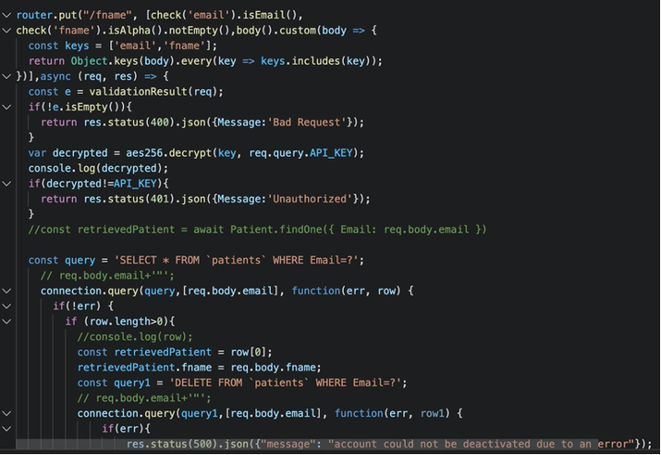
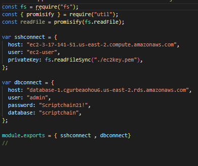
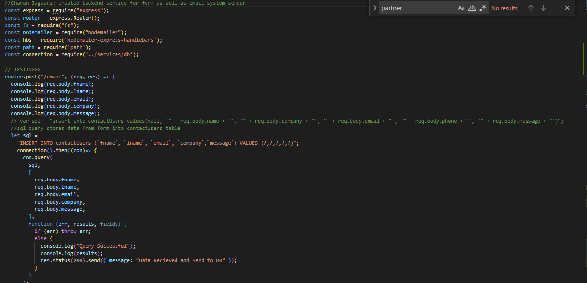

**Default standards for every API:**

1. Used prepared SQL queries in order to prevent SQL Injections
1. Using static API KEY for now for accessing the apis - dynamic in development
1. Errors 400, 401 etc are standard
1. Every API has express validation before the data enters into the api
1. AWS’s SQL is used as the dbms here
1. Logging is in place in the AWS, needs to be enhanced
1. Mailer is used as per the requirement, new design schema is available

Things to be done:

1. Test cases need to be worked on and made sure that they are robust and work properly. They need to cover all aspects of the end point that it is testing.
1. Once all test cases work as desired, uncomment the code in .github/workflows/ci.yaml to run the tests as well when the CI/CD pipeline is executed.

**Title: CaregiverController and PatientNewController**

**Description:**

- /caregiver
- / - POST : firstName, lastName, email, phone, employer are the parameters to be stored in the caregivers table from the frontend which is what happens.
- /patientnew: The doctor adds a patient here and the patient registers oneself below
- / - POST : firstName, lastName, email, phone are the parameters to be stored in the caregivers table from the frontend which is what happens.

**Screenshots:**

**Title: PatientController** 

/patient

**Signup:**

**Prompt:**

- First goes the mobile/email prompt for signing up by a doctor. This is already implemented here, <https://github.com/mohnoori/scriptchain/blob/master/web-application/angular/src/app/index.js>, needs testing though

**Title: blogController**

- /blog\_service

**Description:**

- /keywordSelection : Extract keywords from the given content.

**Screenshots:**

**Signup:**

- We have email/phone, password. There is an upload option here mentioned. We need to save all the images getting uploaded as well.
- Once an account is created, the standard jwt token generation/verification has to be done along with the email.

**Note:** In this UI, change the progress bar from currently an image to an actual one. 

**Description:**

- / : Fetch patients from the database. To be used in patient provider
- /:id : Fetch a patient record based on id. To be used once the above request response arrives and based on the id we hit this api
- /:verify : Used to check if a patient with an email id exists. If doesn’t exist, can be used to create a new account
- / - POST: Posts many parameters required for creating a new patient account - deprecated(not shown)

**Still need to be done:**

1. SMS testing

**Screenshots:**

**Title: patientLoginController**

- /patient-login

**Description:**

- **/ :** Has a post request for email and password but need to make it email/phone and password.
- /verifytokenintegrity : Jwt token is validated here.

**Screenshots:**

**Title: verifiedController**

- /verified

**Description:**

- / : After an account is initiated for patient creation, an email is sent to the user. Once the user clicks on it, verification succeeds and so the addition into the patient table

**Screenshot:**

**Title: healthcareProviderController**

- backend/healthcare

**Description:**

- /account/create: Creation of an account. Needs inclusion of image upload. 
- /account/verify: Once creation is done, verification happens.

**Screenshots:**

**Title: healthcareProviderLoginController**

- /backend/healthcare-login

**Description:**

- / : Email and password are posted to authenticate a provider
- /verifytokenintegrity : Signed JWT is validated for the authenticated user details stored in localstorage(fetched and verified here on say browser refresh)

**Screenshots:**

**Title: newUsersController**

- /request\_access

**Description:**

- / : posts data for a healthcare provider who wants to access the healthcare provider portal

Still need to be done:

1. UI needs to be implemented

**Screenshot:**

**Title: contactUsController**

- /contact\_us

**Description:**

- / : Posts data, saving into the contactUsers table
- The uncommented code will save data into the contactUsers table. Currently the AWS rds database is encrypted using KMS( Key management system), this breaks the uncommented code and requires a further look over. The uncommented code will error and return an incorrect console log.
- New code by Vince Guan will send the firstname, lastname and message data to an email. The email system set up in this chunk of code works and will error with the correct console logs. **Screenshot:**

**Title: CareersController**

- /careers

**Description:** 

- /jobposting: New job information is posted here. Doesn’t have a UI. For Admin.
- /jobposting: Gets job postings. UI was originally created. Need to use a new one.
- /jobposting/:jobcategory: Gets jobpostings based on categories. Not in use
- /jobcategory: New job information is posted here. Doesn’t have a UI. For Admin.
- /jobcategory: Get and post job categories. Not in use
- /jobposting/job/:jobid: Posts a job with jobid. Not in use

Still need to be done:

1. Need to create a new UI for this. Also may implement application uploads here.

**Screenshot:**

**Title: resetPasswordController**

- /reset\_password

**Description:**

- / : Posts a request for reset. An email is sent
- /check : Jwt is validated from email sent
- /change\_password : Details are submitted to the backend for updating

Still need to be done:

1. Needs new UI and new email design also has to be implemented

**Screenshots:**

**Title: healthcareProviderResetPasswordController**

- /backend/healthcare/reset\_password

**Description:**

- / : Posts a request for reset. An email is sent
- /check : Jwt is validated from email sent
- /change\_password : Details are submitted to the backend for updating

Still need to be done:

1. Needs new UI and new email design also has to be implemented

**Screenshots:**

**Title: deactivateController**

- /backend/deactivate

**Description:**

- /patient : A patient entry is deactivated by deleting it from the patient table and placing it in the deactivatedPatients table. Need to empty this after a span of time.
- /healthcare: A healthcare provider’s entry is deactivated by deleting it from the healthcare table and placing it in the deactivatedHealthcare table. Need to empty this after a span of time.

Still need to be done:

1. There is no new UI for this. Needs one.

**Screenshots:**

**Title: cacheController**

- /cache\_service

**Description:**

- /getFromCache: Access token is fetched from here
- /storeInCache: Access token is stored here

**Screenshot:**

**Title: partnersController**

- /partners

**Description:**

- / : The details for partners is posted here

**Screenshot:**

**Title: reactivateController**

- /backend/reactivate

**Description:**

- /patient/request: Checks if the patient is present in deactivated patients
- /healthcare/request: Checks if the Healthcare provider is present in deactivated patients
- /patient/activate: Inserts the deactivated entry into the patients table
- /healthcare/activate: Inserts an entry into the healthcare table

Still need to be done:

1. Doesn’t have a UI at all.

**Screenshots:**

**Title: editPatientController**

**Description:**

- /fname: Edit patient’s firstname - deprecated
- /lname: Edit patient’s lastname - deprecated
- /phone: Edit patient’s phone - deprecated
- /password: Edit patient’s password - deprecated

**Screenshots:**

**Title: Database**

**Description: Relates to most controllers in the backend**

- The database is encrypted based on AWS KMS encryption keys
- The database is currently unreachable through our NODE backend
- There is an apiRequest error or encryption error when trying to connect to the database through node. 
- See line 77 in security\_utils.js for corresponding error
- Anytime the function APIRequestIsValid() is called upon, there will be the same error
- 

**Database Entry Information**
- 
- Host, aka website dns is the access point for entering db through aws.
- User: Default is always ec2-user when using ec2 instance (which we are) called bastion host on aws user account
- privateKey: reads the pem file which is a form of encryption. This file has to be in the same folder as the database access file.
- ^ All this information is needed when accessing a database through ssh
-user: always admin.

**To Access Database in MySqlWorkbench**
- Toggle to connection over TCH
- Update same information

**Title: ContactUsController.js** (Complete)

- /ContactUsController

**Description:**

- / : backend email and database store api for contact us form

**Screenshot:**

**Title: employee.js** (Complete)

- /employee

**Description:**

- / : gets id for employee as well as db store api

**Screenshot:**

**Title: requestAccessController** (Complete)

- /requestAccessController

**Description:**

- / : mail sending and database storing api

**Screenshot:**

