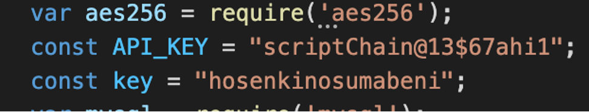

**Backend suggestions:**

1. Keep the database connection information in a separate file and then import it in all the files that need it.
   a. **Purpose:** It will help us reduce code repetition and make the code cleaner.
2. Instead of using a hardcoded password, set it as an environment variable and use that instead.
   a. **Purpose:** Having a hardcoded password is a security risk. Even the slightest leak of any of our code can cause our database password to be exposed.

3. Fixed: This is in a new file called db\_connection.js. The password is now set as an environment variable.

4. Important constants such as the API key and the key should also be kept as environment variables.
   a. **Purpose:** Having a hardcoded string is a security risk. Even the slightest leak of any of our code can cause our database password to be exposed.

5. Fixed: The API key and Key is now set as an environment variable.

6. The oauth2Client information should also be added to the environment variables.
   a. **Purpose:** Having a hardcoded string is a security risk. Even the slightest leak of any of our code can cause our database password to be exposed.

**API Key Security:**

1. To use a proxy server. Let the frontend send requests to the proxy server and then the proxy server will send the request to the desired endpoint using the API Key 
   1. Problems with this approach: The proxy server’s end point will still be visible at the frontend. Masking? Masking isn’t possible as far as I understand.
2. Only dedicated machines will be able to hit the proxy/cache server. Register their machines within our server. We should grant the admin the access to register any machine with us. In this way, only a few machines will be able to access our APIs and this is highly secure.
3. To fetch a token from the server that matches the private key on the backend.
   a. Problems with this approach: This public token is static. Whoever gets the public token will be able to access our APIs.
   b. We need to make this dynamic. Everytime the frontend is loaded, we generate a new token with which a user will be able to access our API. Also we need to make sure the token is not reusable.
   c. Use IPaddress + key + time stamp and encrypt.
4. We need both of these in place.

**To do:**

**Django concurrency implementation:**

Detailed insights: https://www.programmersought.com/article/54426654549/ 

Each interface that calls EHR data will be equipped with multithreading. The view that calls these interface methods will be asynchronous, as to prevent blocking.

