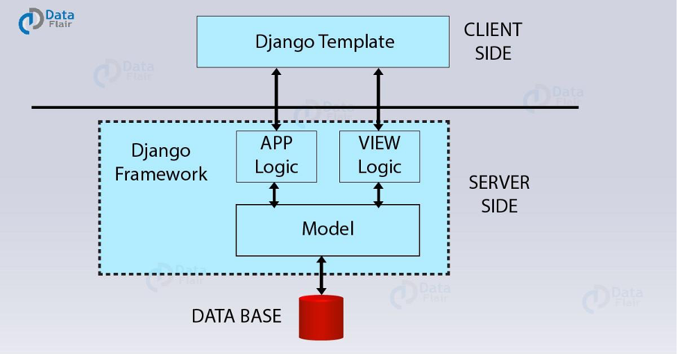

**Django Service Overview**

**Functionality:**

**Data fetching & analysis service**

**Fetch EHR data, perform CDV risk analysis, predictions:** 
**

**Problem Statement:** Collect relevant information of a patient from the EHR vendor  and generate predictions from trained models yet to be deployed in Cloud Storage Bucket.
**

**Input:** Expect the provider to search for a patient using the name/ ID/ email/ activity/  appointment.
**

**Output:** Collect the relevant medical information of a patient from anEHR vendor, unpack the relevant ML model yet to be stored in Cloud Storage Bucket, and generate predictions.   
**

**Workflow:** Angular requests Django, Django passes data through ML model, Django returns response to Angular for display to user.

Data flow in Django:

**ScriptChain Django Service:**

The ScriptChain web app will use the Django service as a backend service for AI driven data analysis. Building out the **client side** is not necessary.

The **app logic** consists of API integrations for EHR systems, data analysis using AI models, and concurrency features for data fetching. 

The **view logic** serves to make the app logic available via HTTP endpoints. We can send data to the service using a POST request, and get back a complete analysis from an AI model. 

The views will make the data fetching and analysis service available to the rest of the ScriptChain web application. The user will make the request from the Angular UI, which will be validated and sanitized in the Node backend. The Node backend will then request the Django service with EHR requests to be made. Django fetches the data, processes it and then sends the analysis as a response. The Node backend then returns the response back to the user.

The **database** for the ScriptChain web app is not consumed by the Django service. All database logic can be found in the Node backend, in the file *db\_utils.js*. **Models** need not be implemented in the Django service, because it uses no database.

**Developer Quickstart:**

See readme in the Django-REST-API folder. 

**Implementation**

**App logic:**

EHR Integrations: 

Each integration contains the necessary functionality to request data from each EHR system. Generally speaking, the following are required: authorization, endpoint integration, and a handler function.

- EpicInterface.py - John
- AthenaInterface.py - Tejvir
- AllScriptsInterface.py
- CernerInterface.py - John

`     `Complete     In progress     Not started

Data Analysis:

TO DO: Ask the AI team how the models are available for feeding and analysis. Technical specification on input data formatting would be useful. Data will be preprocessed into this form, processed with the AI models, then returned to the Node backend.

**View logic:**

helloWorld: 

Path: /

This view just serves as a testing view for development. Methods can be included in the endpoint to test their functionality within the running application. Returns the message “Hello World!”.

generateAnalytics:

Path: /generateAnalytics

This is the view that will be called to feed data into the AI models in order to receive data analysis. Data will be included in the request body, indicating the data that the service needs to fetch. Django will then make all of the FHIR requests, preprocess the data, and process it with the AI models. The caller will then receive the predictions as a response. 

This view is implemented to be asynchronous. Whenever called upon, it will drop an event listener for the response and run in parallel to the rest of the application. This prevents blocking during the data fetching process.

