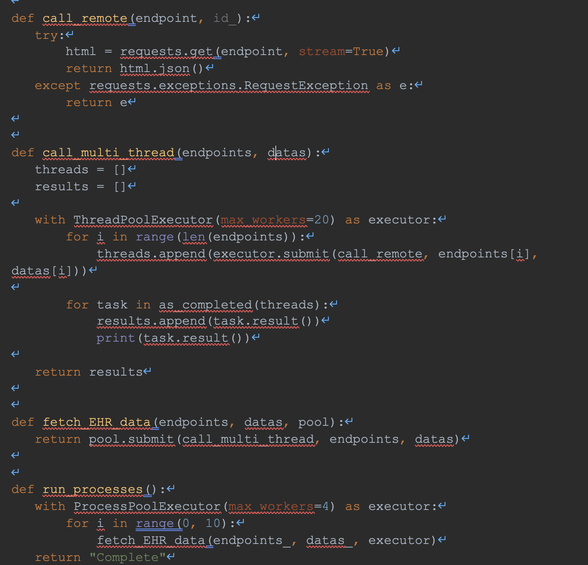

**EHR API Concurrency**

**Intro**

Many concurrent HTTP requests are needed to retrieve the data from EHR systems. When choosing between Node and Django, it should be noted that faster performance is achieved through Python’s multithreading over JavaScript’s asynchronous event loop (see results). So, Django appears to be the better choice.

However, these API calls will block the rest of the application from running while they themselves run. This can be handled using a pool of processes in order to run application processes asynchronously. Multiprocessing allows the API calls to run in parallel to the other functionalities of the application, while still utilizing multi-threading in Python. 

**Concurrency Structure**

The application runs in the Main process, which runs on a single thread, as is by default in Python. When an API call is made, a new process is made (the API process). Within that process, up to 20 threads are created to make the HTTP calls. 

The Main process and the API process will run concurrently in an asynchronous fashion. If another API call is made before the API process completes, an additional API process is created until the process limit is reached. Once reached, the calls go into a queue to be taken by the first available process.

New processes, in general, could be spawned to handle any heavyweight calculations that could result in blocking.

**Implementation**

The implementation would require nothing to be done to the application as a whole, but multithreading and multiprocessing must be implemented for the API calls. The Django REST API would call our data fetching function, which would manage our processes and threads.

The ThreadPoolExecutor [1] and ProcessPoolExecutor [2] classes are useful classes for managing concurrency. They both extend the Executor class, from which we will use two methods: the submit method, which runs a function in the pool, and the result method, which returns the result of a completed function.

Functionality to make the HTTP calls, manage the thread pool, and manage the process pool are required. The coded implemented in python3 for this solution would look like the following:

run\_processes() is the function to invoke, which we can consider an instance as it houses our ProcessPoolExecutor. On these processes, each invocation of fetch\_EHR\_data spawns at most 20 threads to handle the HTTP calls. When a process completes, another starts. This is all managed under the hood by the PoolExecutors.

**Conclusion**

This structure will allow the application to run asynchronously with its data fetching, much like JavaScript, but with the benefit of threading the data fetching HTTP calls. This allows the application to serve a greater number of users with great numbers of HTTP calls. The results from my tests were as follows:

**For 10 GET requests; time to complete**

Node.js Fetch API:                  0.836 seconds

Node.js Axios API:                  0.828 seconds

Single-thread requests.py:      1.032 seconds

Multi--thread requests.py:       0.184 seconds **\*\*\* Winner \*\*\***

**For 10 Users making 10 GET requests each, simultaneously; time to complete all**

Node.js:			  7.982 seconds

**Python**

Single-thread, single-process: 12.345 seconds

Multi-thread, single-process:    2.058 seconds

Multi-thread, 3-process:           1.044 seconds

Multi-thread, 8-process:           0.884 seconds **\*\*\* Winner \*\*\***

Using Node 14.0 and Python 3.8

**References** 

[1] https://creativedata.stream/multi-threading-api-requests-in-python/

[2] <https://www.tutorialspoint.com/concurrency_in_python/concurrency_in_python_pool_of_processes.htm>
