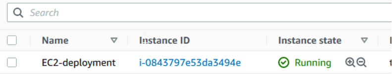
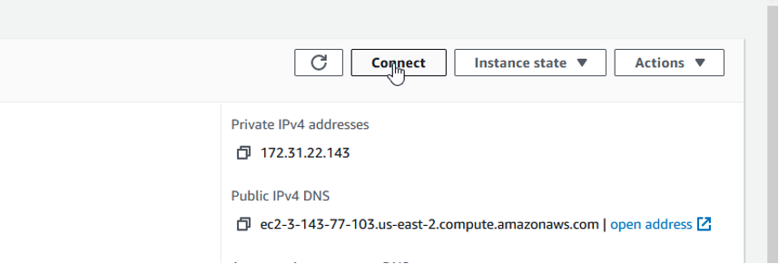
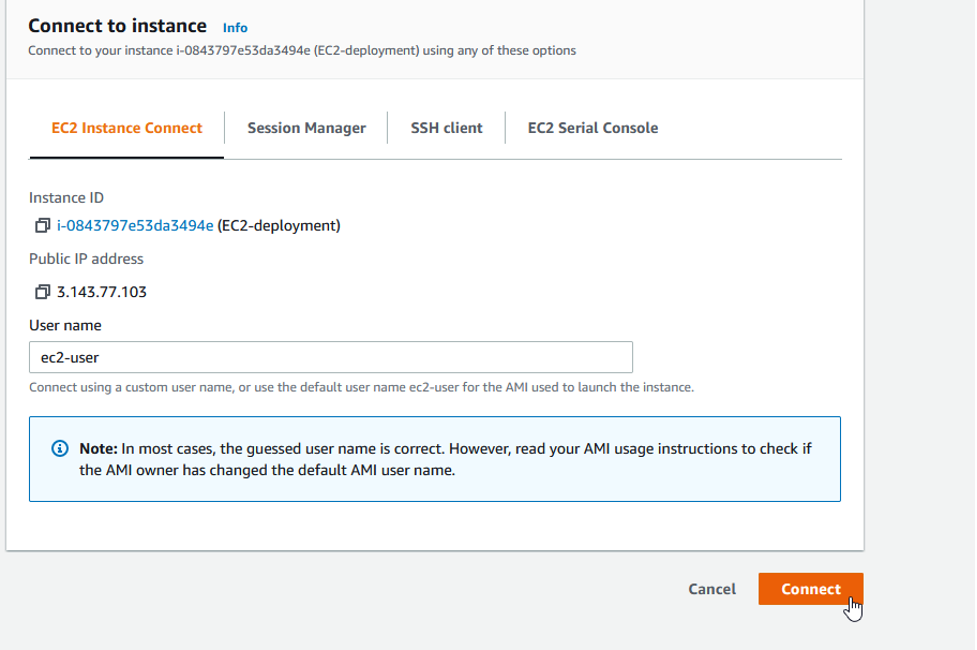
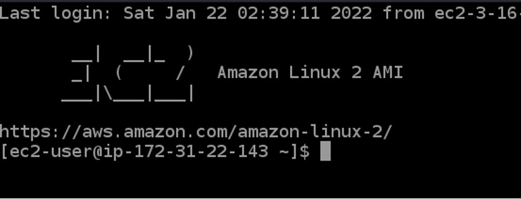
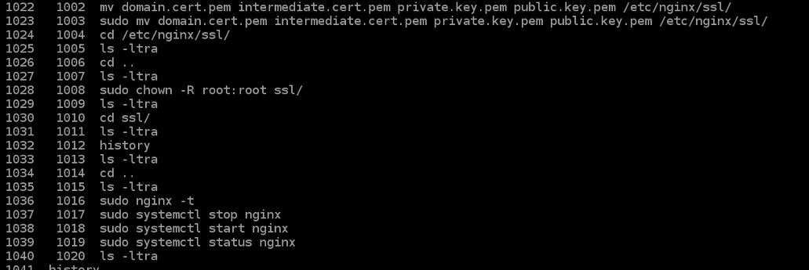

**How to renew SSL certificate on AWS using Porkbun Bundle**

1. Download SSL bundle on your Desktop App under “Bundle” 
2. Open up terminals on your local machine 
3. Enter in the command line on your **local machine**: 
4. Locate the bundle after unzipping the file
5. Put in command line “cd” then “ls” to navigate to the file itself
6. Once in the ssl bundle file then run command line in step #8
7. scp -i <Source directory> -r <files> <ec2-user@ec2-3-143-77-103.us-east-2.compute.amazonaws.com>:<Destination directory> (

`	`For example: 

8. scp -i ~/.ssh/id\_rsa -r \*.pem <ec2-user@ec2-3-143-77-103.us-east-2.compute.amazonaws.com>:/home/ec2-user/ 

(Will need to update the file name directly with the ssl cert that was downloaded to local machine. Rename it so it is easy to trace and remove the\*.pem and replace with ssl bundle name after step 8 with same command line)

9. Log in to ec2 either from your terminal using the following command: 

`      `ssh -i DEV\_key.pem <ec2-user@ec2-3-19-37-85.us-east-2.compute.amazonaws.com>

10. Or you can use the ec2 console provided by AWS 

Click on the instance ID

Click on the connect button

Click on the connect using the first option

You are logged in 

11. Follow the steps below from 1023 to 1039

12. Check to see if the application is running on the website. 
13. If the steps don’t work properly then redownload the bundle and follow the steps again. Be aware of the location of the etc2 instance.

