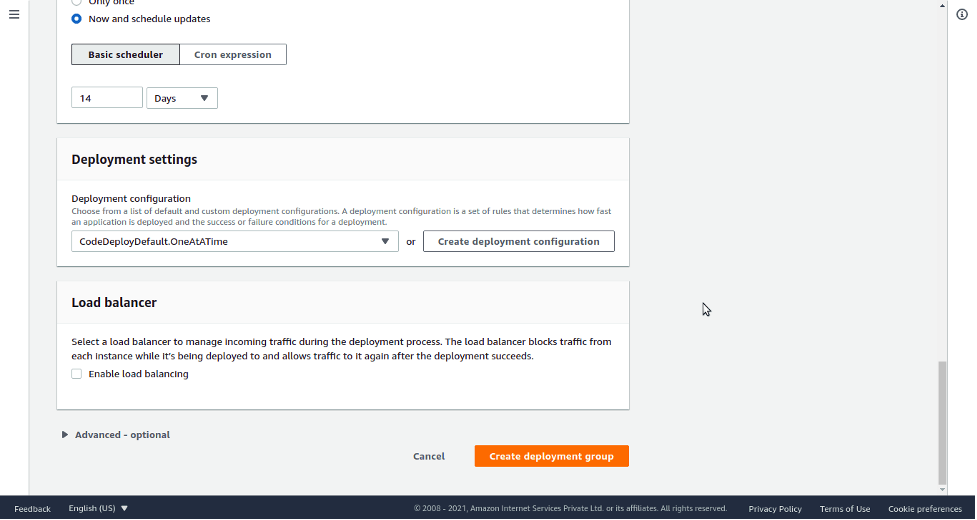

## **Prerequisites:**
1. Github Account
2. AWS Account
## **Agenda:**
1. [Create IAM Role for EC2.](https://afourtech.com/complete-guide-to-deploying-github-project-on-amazon-ec2-using-aws-codedeploy-service-and-github-actions/#post-54909-_heading=h.3znysh7)
2. [Create IAM Role for CodeDeploy.](https://afourtech.com/complete-guide-to-deploying-github-project-on-amazon-ec2-using-aws-codedeploy-service-and-github-actions/#post-54909-_heading=h.3dy6vkm)
3. [Create EC2 Instance](https://afourtech.com/complete-guide-to-deploying-github-project-on-amazon-ec2-using-aws-codedeploy-service-and-github-actions/#post-54909-_heading=h.2s8eyo1)
4. [Launch EC2 Instance](https://afourtech.com/complete-guide-to-deploying-github-project-on-amazon-ec2-using-aws-codedeploy-service-and-github-actions/#post-54909-_heading=h.3rdcrjn)
5. [Install CodeDeploy Agent on EC2 Instance and nodejs.](https://afourtech.com/complete-guide-to-deploying-github-project-on-amazon-ec2-using-aws-codedeploy-service-and-github-actions/#post-54909-_heading=h.26in1rg)
6. [CodeDeploy Service Configuration.](https://afourtech.com/complete-guide-to-deploying-github-project-on-amazon-ec2-using-aws-codedeploy-service-and-github-actions/#post-54909-_heading=h.1pxezwc)
7. [Github Project.](https://afourtech.com/complete-guide-to-deploying-github-project-on-amazon-ec2-using-aws-codedeploy-service-and-github-actions/#post-54909-_heading=h.z337ya)
8. [Github actions workflow pipeline.](https://afourtech.com/complete-guide-to-deploying-github-project-on-amazon-ec2-using-aws-codedeploy-service-and-github-actions/#post-54909-_heading=h.1ci93xb)

We will be using ap-south-1, an AWS region, for this blog setup.

Quick Note: Please select a particular region of AWS Services where you will deploy this application and, CodeDeploy, Github will use the selected region.
# A. Create an IAM Role for EC2.
Search for IAM Service in the search bar.

On to right side

Access Management -> Roles

Click on Create role.

Select type of trusted entity as AWS Service

Choose a use case as EC2.

Click on the *Next: Permissions* button

On the permission page, select AmazonEC2RoleforAWSCodeDeploy policy and click on the *Next: Tags* button.

Leave the Tags tab as it is optional and click on the *Next: Review* button.

Pass ec2\_role as Role name and click on *Create Role* button.

Open the ec2\_role role and go to the *Trust Relationships* tab.

Click on the *Edit trust relationship* tab. Copy-paste the below content and click on the *Update Trust Policy* button.

{

“Version”: “2012-10-17”,

“Statement”: [

{

“Effect”: “Allow”,

“Principal”: {

“Service”: “ec2.amazonaws.com”

},

“Action”: “sts:AssumeRole”

}

]

}

# B. Create an IAM Role for CodeDeploy.
Search for IAM Service in the search bar.

On to right side select

Access Management -> Roles

Roles

Click on Create role.

Select type of trusted entity as AWS Service

Choose a use case as EC2.

Click on the *Next: Permissions* button.

On the permission page, add below policies

AWSCodeDeployRole

Click on the *Next: Tags* button. Tags could be ignored. Click on the *Next: Review* button.

Pass codedeploy\_role as Role name and click on *Create Role* button.

Open codedeploy\_role role and go to the *Trust Relationships* tab.

Click on the *Edit trust relationship* tab. Copy-paste the below content and click on the *Update Trust Policy* button.

{

“Version”: “2012-10-17”,

“Statement”: [

{

“Effect”: “Allow”,

“Principal”: {

“Service”: “codedeploy.amazonaws.com”

},

“Action”: “sts:AssumeRole”

}

]

}

# C. Create EC2 Instance
Search for EC2 service in the search bar.

Click on the EC2 Dashboard on the right side

Click on the *Launch Instance* button.

Select AMI setup as per your project requirement.

This blog needs below setup

Ubuntu Server 18.04 LTS (HVM), SSD Volume Type (64-bit Arm). Click on select.

Choose an Instance Type as t2.micro. Click on *Next: Configure Instance Details*

To establish the connection between the EC2 instance and code deploy, Select ec2\_role in IAM Role, which we created before and click on *Next: Add Storage*

Let the Add Storage part be as it is. Click on the *Add Tags* button.

On the tag page, add the tag as key/value pair. In our case, I have added blog\_app/nodejs; The tag will require creating a *code deploy* service. Click on the *Next: Configure Security Group* button.

In the Configure Security Group page, Add Rule called Custom TCP Rule, a select source called anywhere. Click on the *Review and Launch* button.

Review all details once and click on the *Launch* button. Wait for a few minutes to launch EC2 Instance.

Download key/pair if you want to login into an instance using ssh.
# D. Launch EC2 Instance
Go to EC2 Dashboard, right-click on the EC2 instance generated earlier, and click on connect.

Take note of the public IP and username on the connect to instance page.

You can connect to an instance using an ssh client. Check the third tab on the same page.

We will be logging into the instance using the PPK file. Convert generated PEM file into PPK and log in using putty ssh client software.

Alright, now our EC2 is set up. Let’s catch up on the AWS CodeDeploy configurations.
# E. Install CodeDeploy Agent on EC2 Instance and nodejs.
To ensure our application can run properly on the EC2 server, we need to install the required packages. Since we are using Node Application, we must install nodejs related packages and a git module to enable the server environment to use the git services.

Login into an instance with a public IP, username, and PPK file. Now we are on the EC2 server. Install the required packages by running the command below.

sudo apt update

sudo apt install nodejs -> node -v

sudo apt install npm -> npm -v

sudo apt install git -> git –version

npm install pm2 -g

The CodeDeploy agent is a software package that, when installed and configured on an instance, makes it possible for that instance to be used in CodeDeploy deployments.

Use below commands to deploy code deploy agent on EC2 instance using putty ssh client.

sudo apt update

sudo apt install -y ruby

sudo apt install wget

wget <https://aws-codedeploy-ap-south-1.s3.ap-south-1.amazonaws.com/latest/install>

chmod +x ./install

sudo ./install auto

sudo service codedeploy-agent start

sudo service codedeploy-agent status

Clone github repo into EC2 server.

git clone https://github.com/your-repo/blog\_app
# F. CodeDeploy Service Configuration.
AWS CodeDeploy is a fully managed deployment service that automates software deployments to various compute services such as Amazon EC2, AWS Fargate, AWS Lambda, and your on-premises servers.

Search for CodeDeploy in the search bar and select it.

Create an application as nodeblog\_application and select the compute platform as EC2/On-premises. Click on the Create application button.

Click on the Create deployment group button. Give deployment group name as nodeblog\_deployment.

Select service role as codedeploy\_role that was created

Deployment type as In-place

In Environment configuration, select Amazon EC2 Instance and select tag as blog\_app/nodejs

In Deployment settings select CodeDeployDefault.OneAtATime.

Click on Create deployment group without a load balancer.
# G. Github Project.
Create any node js project you wish and create appspec.yml in the root directory—appspec.yml file used by the CodeDeploy service to manage deployment.

version: 0.0

os: linux

files:

– source: .

destination: /home/ubuntu/blog\_app

hooks:

ApplicationStop:

– location: scripts/application\_stop.sh

timeout: 300

runas: ubuntu

ApplicationStart:

– location: scripts/application\_start.sh

timeout: 300

runas: ubuntu

Github uses aws.yml file to manage Github actions.

scripts/application\_start.sh

#!/bin/bash

\# give permission to the files inside /secure\_docs directory

sudo chmod -R 777 /home/ubuntu/blog\_app

\# navigate into current working directory

cd /home/ubuntu/blog\_app

\# install node modules

npm install

\# start our node app in the background using pm2

sudo pm2 start ‘npm start.’

scripts/application\_stop.sh

#!/bin/bash

\# stop existing node servers

echo “Stopping any existing node servers.”

PKILL node
# I. Github Actions workflow pipeline
First, create an [IAM user](https://docs.amazonaws.cn/en_us/IAM/latest/UserGuide/id_users_create.html#id_users_create_console) with full AWSCodeDeployFullAccess policy and generate an [access key and secret access](https://docs.aws.amazon.com/IAM/latest/UserGuide/id_credentials_access-keys.html#Using_CreateAccessKey) for the user to configure GitHub Action.

Configure the secrets in Github Repository.

To create the CI/CD workflow in GitHub Actions, create a file named .github/workflows/aws.yml in our application root that will contain the GitHub action workflows. You can use the code below in the terminal as the guide to achieving this process.

name: Automate Deploy to Amazon EC2 using Github actions

on:

push:

branches: [ master ]

jobs:

deploy:

runs-on: ubuntu-latest

steps:

\# Step 1

– name: Checkout to repo

uses: actions/checkout@v2

\# Step 2

– name: Configure AWS credentials

uses: aws-actions/configure-aws-credentials@v1

with:

aws-access-key-id: ${{ secrets.AWS\_ACCESS\_KEY\_ID }}

aws-secret-access-key: ${{ secrets.AWS\_SECRET\_ACCESS\_KEY }}

aws-region: ap-south-1

\# Step 3

– name: Create CodeDeploy Deployment

id: deploy

run: |

aws deploy create-deployment \

–application-name nodeblog\_application \

–deployment-group-name nodeblog\_deployment \

–deployment-config-name CodeDeployDefault.OneAtATime \

–github-location repository=${{ github.repository }},commitId=${{ github.sha }}

Now make a change to your repository. Your changes should automatically deploy to your EC2 server.

Please check the IP address generated for your application. Access the application from a web browser or postman.

