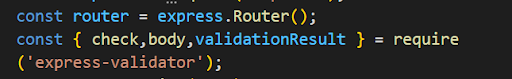
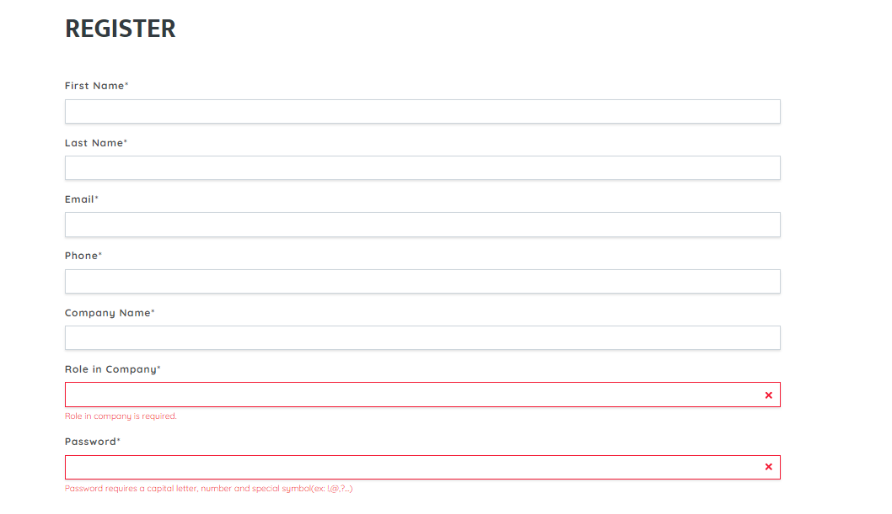
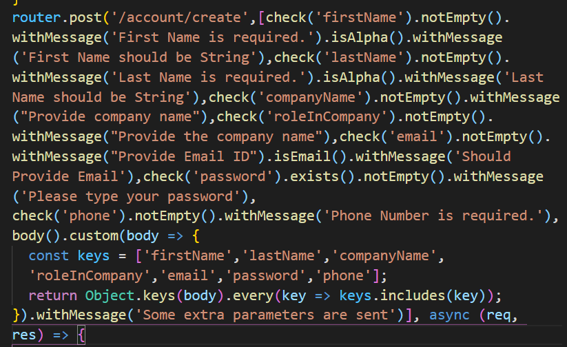
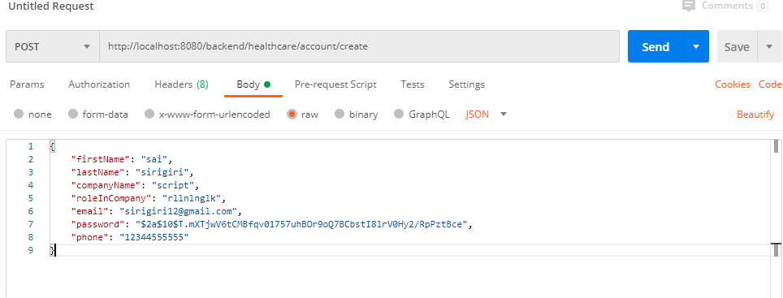
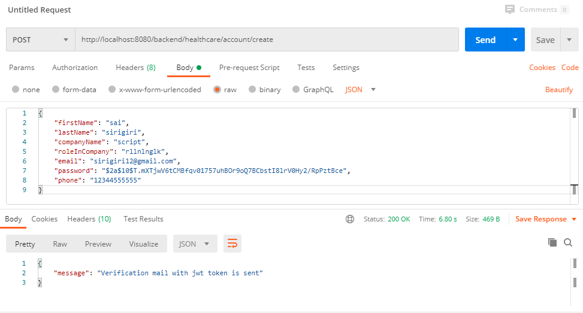
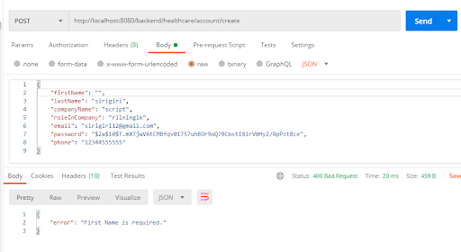
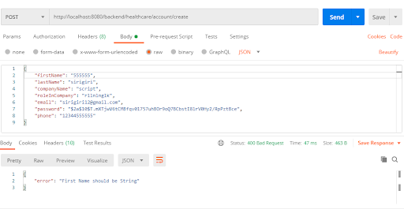
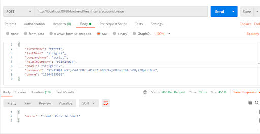
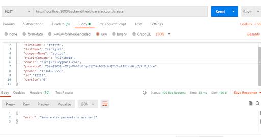

**Validation Scripts for the API endpoints**

**Importance of Validation Scripts:**

Validation scripts are useful when we want to validate the value in some specific data type fields(data validation). Also helps in the usability of the application and allows the user why certain input fields are not accepted.

In our application we have used express-validator for validating the node js code.

**Steps:**

*   Navigate to the node folder using the command-- cd node
*   After navigation to the node folder install the express validator using the command--- npm install --save express validator
*   Verify the package.json file in the node folder if the express validator dependency has been installed or not.
*   Follow the official documentation of the express validator to further include any other functionalities  [https://express-validator.github.io/docs/](https://express-validator.github.io/docs/)
*   In every controller include the check,body methods along with the validationResult from the express-validator as shown below.

*   Now, we need to write the validation scripts for all the methods GET, POST and so on that are in the controller
*   In this document, we are only reviewing the HealthcareProvider controller to explain how to write the scripts for both GET and POST methods. We need to follow the same steps for other controllers as well

**Validation scripts for POST method:**

*   For writing the scripts for any method, we need to first run our angular code using the following commands
1. Navigate to the angular folder in the web application
2. Run the command--- ng serve
3. Open the browser and open the application using--[http://localhost:4200/](http://localhost:4200/)
*   As we are only reviewing healthcareProviderController, first navigate to the healthcare portal using the  [http://localhost:4200/healthcare/register](http://localhost:4200/healthcare/register)
*   As we can see that we are trying to register as the healthcare provider 

*   It is significant to validate each field from the node code namely firstname, last name, email and so on as shown in the above screen shot
*   Express validators provides various methods for checking input validation of each field based on the type of check that developer wants to validate
*   We can check particularly by including the method via express-validator. However in our application we mainly used check and body methods.
*   Check method which has the syntax **check([field, message])**
*   Field corresponds to the string or an array of strings of field names to validate against.
*   Message corresponds to an error message to use when failed validators don't specify a message. This is completely optional.
*   We have specified the messages for only few controller but adding messages will definitely be helpful to let the user know which type of error he/she facing
*   Check method will always executes serially as below
1. req.body
2. req.cookies
3. req.headers
4. req.params
5. Req.query
*   Body method which has the same syntax as check but it only checks the req.body 
*   Similarly cookies, headers, params and query which are the same as the check only checks the req.cookies, req.headers, req.params and req.query.

**Writing the validation script for the POST method and testing it using the Postman:**

*   Validation script that has shown above is for creating the healthcare account in the healthcare provider portal.
*   We have validated each field along with the message
*   Here, **[check('firstName').notEmpty().withMessage('First Name is required.').isAlpha().withMessage('First Name should be String'). **
*   Here, FirstName is checked for validation with few parameters that is the firstName should not be empty(User is not allowed to give an empty firstName), and the firstName should be an alphabet only it throws an error when the user provides a number or any other as input.
*   Whenever the user enters any invalid input then the error will be thrown either with Bad Request or with the error message.
*   We need to check if our code works correctly or nor using the Postman.
*   As it is the POST request, It requires to send the body by choosing the method POST as below.

    

*   After successfully sending the body with all the required fields we get the below request which is 200 means that the body is valid.

    

>>>>>  gd2md-html alert: inline image link here (to images/image5.png). Store image on your image server and adjust path/filename/extension if necessary.  (<a href="#">Back to top</a>)(<a href="#gdcalert6">Next alert</a>) >>>>> 

*   If we provide field empty or null then it throws the below error and will not be able to store in our database as shown below

    

*   Also if we do not provide firstName with the alphabet it again throws an error with message string is required.

*   Here the firstName is number so it throws an error as shown
*   Express validator has various methods that validates  various input fields.
*   It has isEmail() which checks if the email is provided is email or not 
*   Consider the below example where the email is not provided instead given some string.

    

*   It throws the 400 error which is bad request
*   We have used body method to allow only the fields that are in the UI and sometimes if the POST method is not secure, then there are chances that it can store other fields in our db.
*   To avoid that, we used body method and allowed keys that are in the UI 

    

*   In the above request we have sent some extra parameters namely id and version that are not part of UI. So, it throws an error as shown above.
