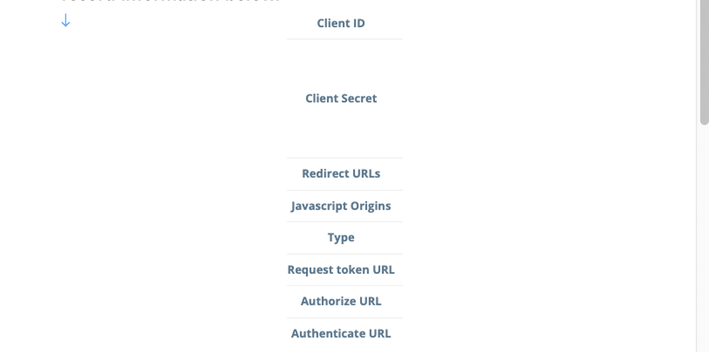
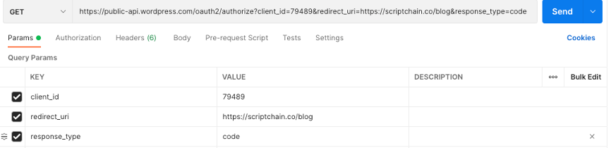
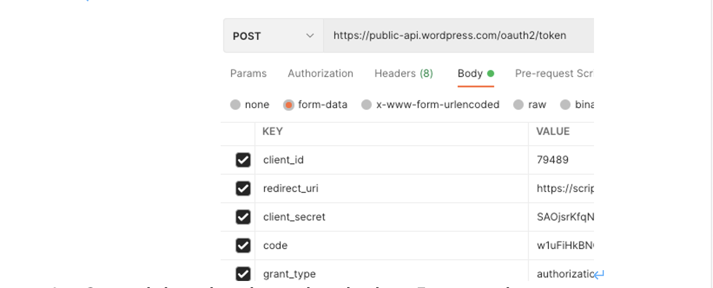
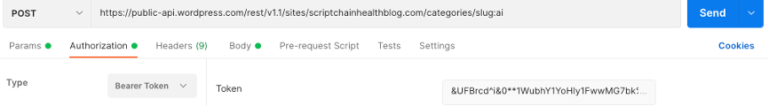

**WordPress API Doc**

1. **Overview**

We are now using WordPress api as our blog page backend support. Because of in compatibility between WordPress v2 and WordPress v1.1, we currently choose to use v1.1. The link for API document is 

https://developer.wordpress.com/docs/api/.

1. **Wordpress API resource Being Used**
- **Posts (get all the posts or a single post)** 

[**https://public-api.wordpress.com/rest/v1.1/sites/scriptchainhealthblog.com/posts**](https://public-api.wordpress.com/rest/v1.1/sites/scriptchainhealthblog.com/posts)

- **Categories (get all the categories or a single category)** 

[**https://public-api.wordpress.com/rest/v1.1/sites/scriptchainhealthblog.com** **/categories**](https://public-api.wordpress.com/rest/v1.1/sites/scriptchainhealthblog.com/posts)

We may make use of comments data/ sharing data or other fields later, please check the official API document for specific information.

**How to modify the backend data?**

- **Current we just need to get access to the WordPress backend <https://wordpress.com/posts/scriptchainhealthblog.com> and manually modify the posts and category related data.**
- **If we want to modify data using REST API, we need get authentication.**

1. **Authentication.**

**https://developer.wordpress.com/docs/oauth2/**

- **Create an application (if not) at <https://developer.wordpress.com/apps/>. And record information below:**
**

- **Go to your browser <https://public-api.wordpress.com/oauth2/authorize> with parameters:**

- **On your redirect URL, you will be able to get a code/token and then to get the token for auth, we need to send a POST request to https://public-api.wordpress.com/oauth2/token**

- **Get auth by using the retrieved token. For example, post a new category by REST API:**

