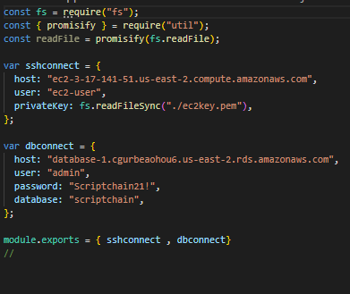

Database Setup

1. Install DBeaver or any other software such as mysql workbench, tablePlus, etc.

2. Create a new connection over SSH/TCH

3.When connecting, insert PemKey File when prompted

4.Enter in these details when prompted:

