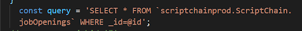

**Prepared Statements**

**What are Prepared Statements:**

Prepared statements are useful for increasing security by separating SQL logic from the data being supplied. This separation of logic and data can help prevent a very common type of vulnerability called an SQL injection attack. A prepared statement is a parameterized and reusable SQL query that forces the developer to write the SQL command and the user-provided data separately. The SQL command is executed safely, preventing SQL Injection vulnerabilities.

**SQL Injections:**

SQL Injection attacks exploit the underlying vulnerability of an SQL statement by inserting nefarious SQL statements into its entry field for execution. Due to this the attacker can view/modify/delete sensitive data of other users or even get unauthorized access to the entire system.

**How to use Prepared Statements:**

In our back-end code, we have used mainly select, insert, and delete queries. It is important to use the prepared statements to make it more secure and further avoiding the SQL injections.

Here is an example of an unsafe approach of queries in our code

SELECT * FROM `scriptchainprod.ScriptChain.jobOpenings` WHERE name = {id}

Below is the example of writing the prepared statement in Node js and Bib Query

Writing the prepared statements varies from language to language. The above-shown query uses @ for protecting the SQL injections in node js and big query. It is for the select statement and changes for insert statements and other queries if incase we add any more in the future.

**Prepared Statements for the Insert query:**

As discussed earlier, the way of writing the prepared statements might change for each. Below is the Insert query prepared statement in the Node JS and Big query.

Here, we have written the statement in such a way that even when we assign any variable or loop that uses the particular query we included the prepared statements.

**Prepared Statements for the Delete query:**

**Authentication to all the endpoints**

Authentication to the endpoints plays an important role to protect the sensitive data, prove identity, and ensure the requests that aren’t tampered with. There are various ways to protect the authentication but in our application, we have included an API key in the request header. 

Authentication of APIs serves the following purposes:

*   Authenticate calls to the API to registered users only
*   Track who is making the requests
*   Track usage of the API

In all the backend controllers, we have assigned a variable API_KEY and use this in the endpoints

After this, we need to check if the endpoint is being used has this API_KEY by adding the following condition to all the end points.

After this, we need to check each and every endpoint in the postman as shown below

**Checking all API endpoint in the Postman:**

If the endpoint is not authorized then it should throw an unauthorized or 401 error as shown below

Here we have given the endpoint with API security key and when we send it and throws an error as below.

Below is the endpoint with the API security key:

We need to every end point if it working or not.

After completing the testing of the backend points in the postman, It is important to change endpoints that are being called in front end as shown below.

Add this security key in the environment.ts file as below

In the frontend under validator folder, for each file, we need to add the security keys

After adding these params in the UI, we need to now check it from the frontend for each component.

. 

