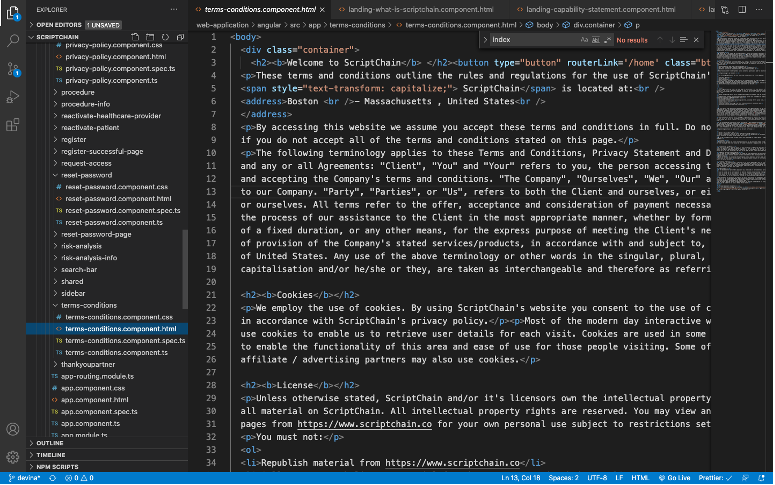

Goal: Document the extra components that do not need to be in the backend that needs revision in order to consolidate the extra components.

Component name: Header 1

Type: 

Description:

Screenshot:

**List of old components that are not in use currently-**

These components don't make sense according to the new design.  

1. **Athenalogin**

** 

2. Commonheader

3. Deactivated-patient

4. Error404

5. Error500

6. Footer

7. Header

8. Mat-confirm-dialogue

9. Reactivate-healthcare-provider

10. Reactivate-patient

11. Search-bar

12. Register

13. Register-successful-page

14. Reactivate-patient

15. sidebar

**List of old components that can be used in the future-**

These components have an old user interface but they can be modified according to the new theme and UI.

1. Privacy-policy

2. Terms-conditions

3. Request-access

4. Reset-password

