# Frontend Components Report

author: Siheng

date: 02/20/2023

---

There are lots of components that contain html&head&body tags, which violate bullet 5&6 of Important Notes on [Frontend Documentation](https://docs.google.com/document/d/1Y5byMoF_FN7QK9fz6U7KPct3xcCky3w8WjN-gmNmuVQ/edit). So they need to be refactored. In this report, I will list all the components that I have refactored for this purpose. By the way, I also handled several hardcode issues to make the codebase easier to update and maintain.

Another two parts that I found when I review the components are that several components may not be used anymore, or it is needed to be fixed.

---

## Components Refactored

Not only refactored html&head&body tags, but also used more professional Angular syntax to handle the hardcode issues to make the code easier to maintain.

- landing-who-we-are
- landing-partnerships
- blog
- landing-faq1
- landing-page
- employee
- apply-job
- becomepartner (add more space above the footer)
- contact (add more space above the footer)
- healthcare-account-settings
- privacy-policy
- request-access
- terms-conditions

Before the refactoring, the html&&head&tag are inside the components. After refactoring, it displays just the content inside the components.

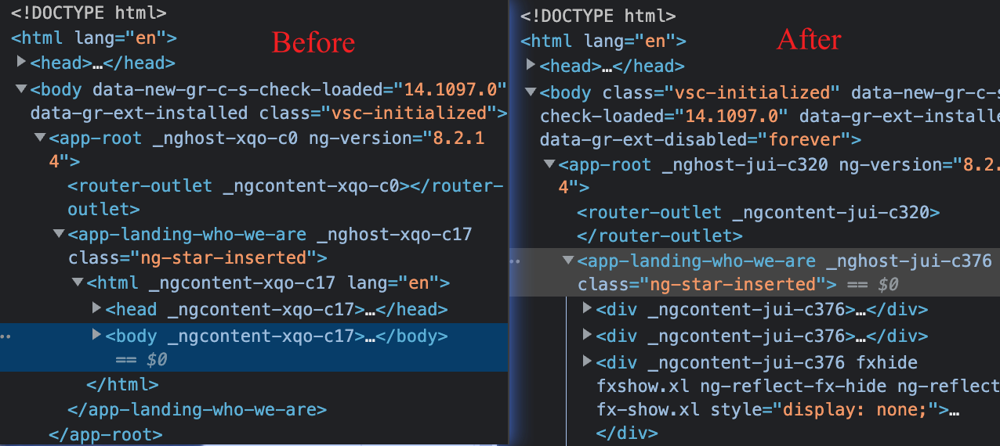

## Components may not be needed

- advisor
  - Both employee and advisor, share the same employee component, and the advisor component is not used anywhere.
- apply-job
  - It seems that we do not use this to post new positions anymore
  - https://scriptchain.co/apply-job/6
- job-openings
  - just a hello on the page
  - https://scriptchain.co/job-openings
- landing-careers
  - no routes linked to it

## Components need to be fixed if they are in use

- LoginComponent (https://scriptchain.co/login)
  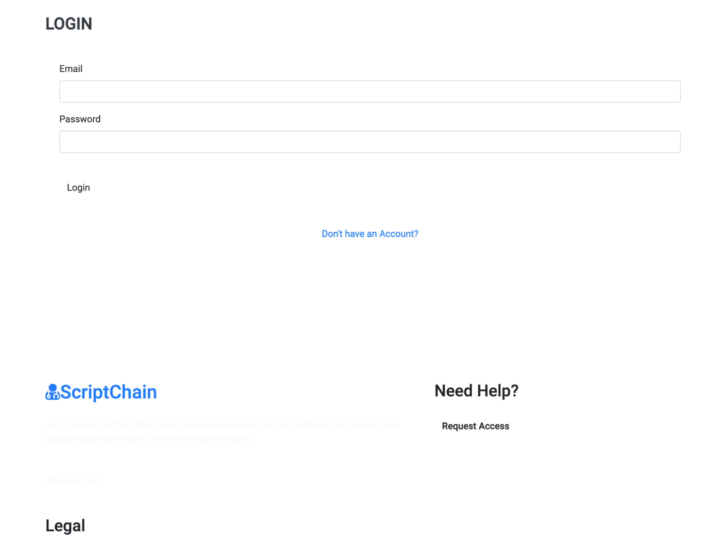

- DeactivatedPatientComponent (https://scriptchain.co/deactivatedpatient)
  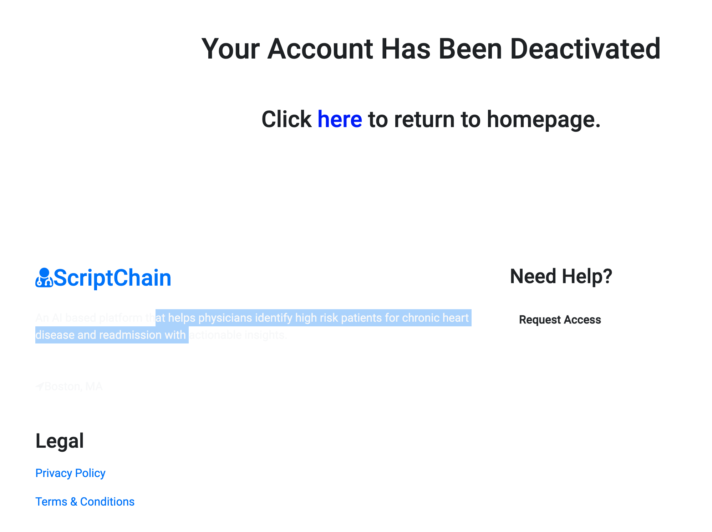

- HealthcareResetPasswordComponent (https://scriptchain.co/healthcare/password/reset)
  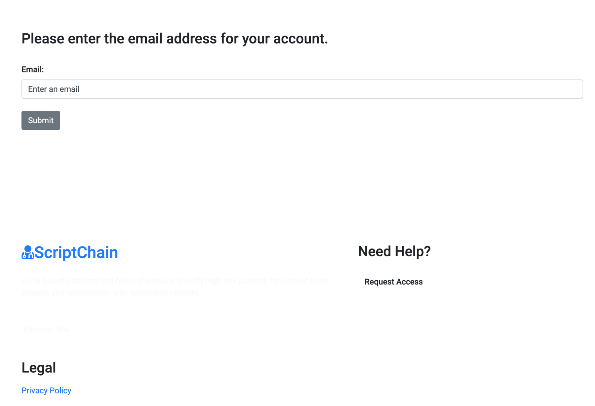

- HealthcareResetPasswordPageComponent (https://scriptchain.co/healthcare/password/resetpage)
  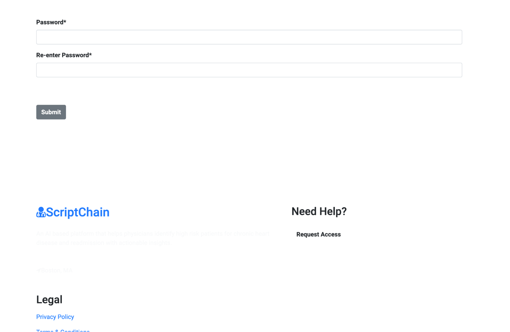

- PatientManageProfileComponent (http://localhost:4200/editpatient)
  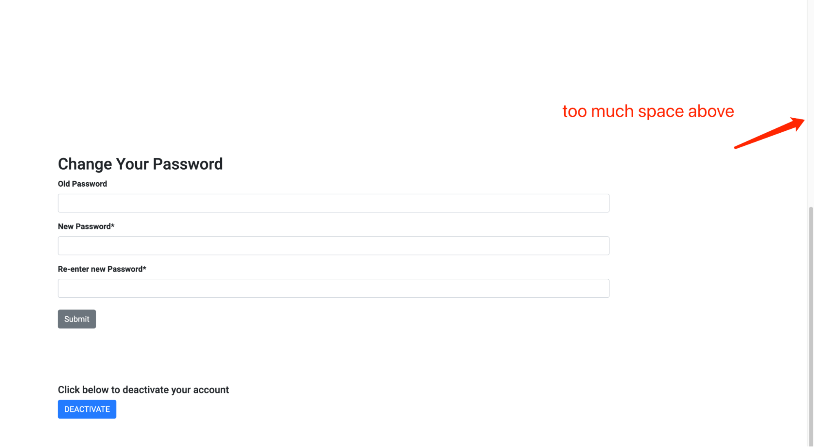

- RegPatientComponent & PatientRegisterthreeComponent & PatientRegistertwoComponent

  - these three components are all linked to the http://localhost:4200/patient/register
  - it cannot be reached on the production version https://scriptchain.co/patient/register
  - so they may not be in use. If they are in use, they need to be fixed
    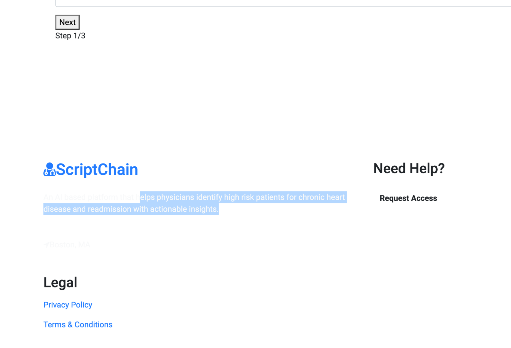

- ReactivateHealthcareProviderComponent (https://scriptchain.co/reactivatehealthcareprovider)
  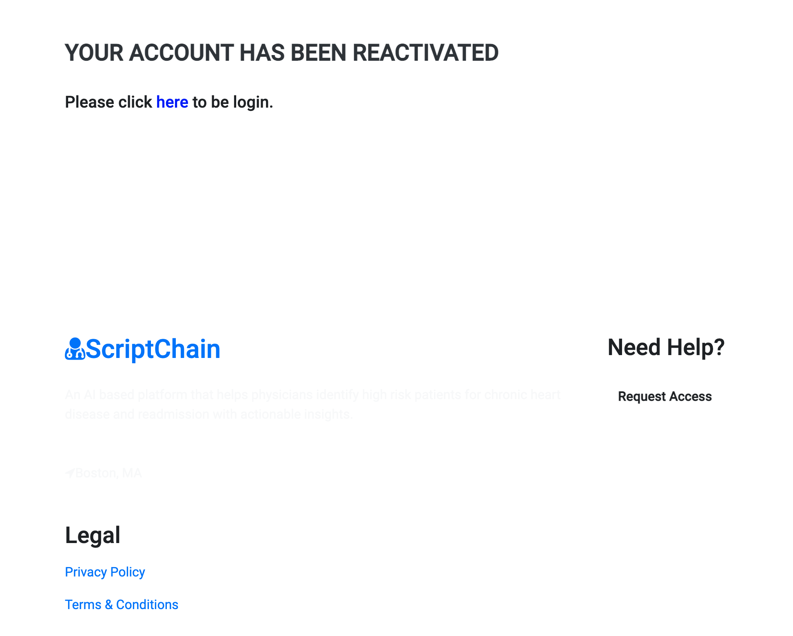

- ReactivatePatientComponent (https://scriptchain.co/reactivatepatient)
  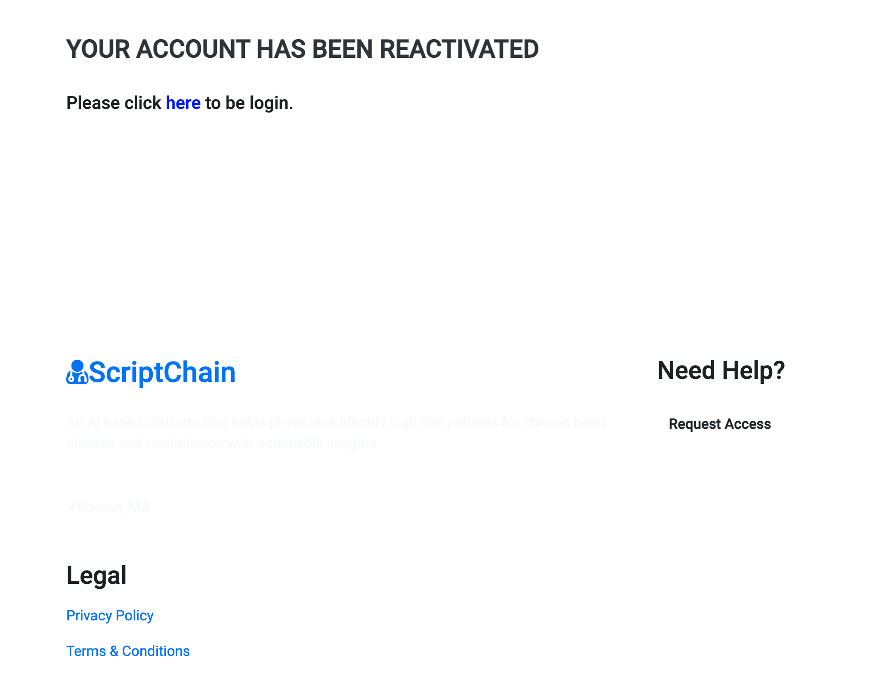

- RegisterComponent (https://scriptchain.co/register)
  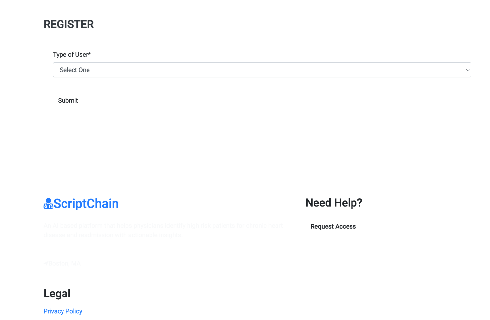

- ResetPasswordComponent (https://scriptchain.co/patient/password/reset)
  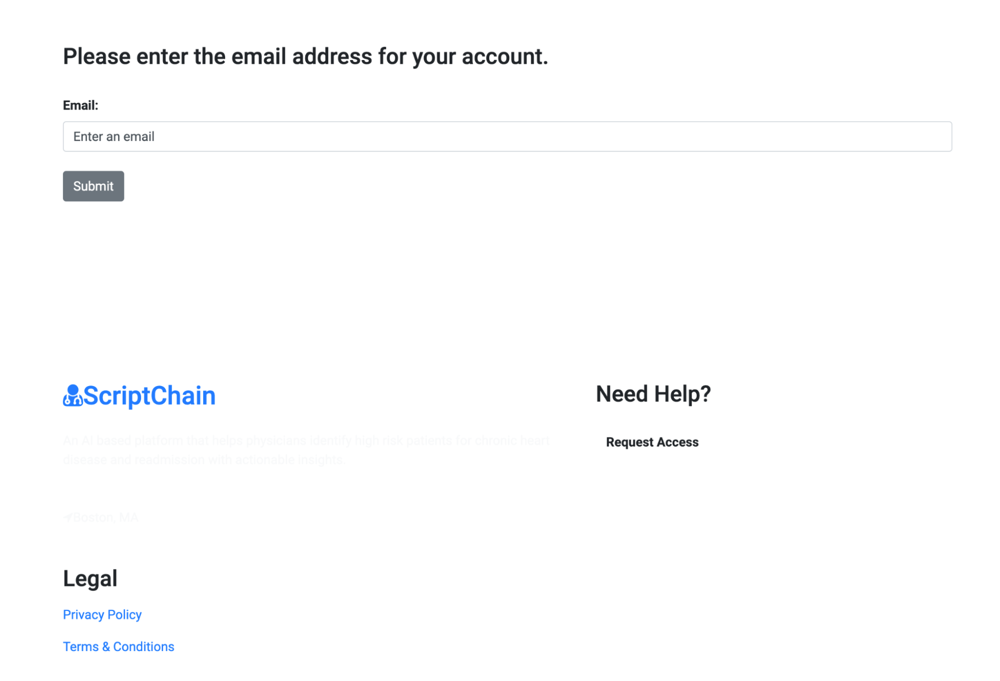

- ResetPasswordPageComponent (https://scriptchain.co/patient/password/resetpage)
  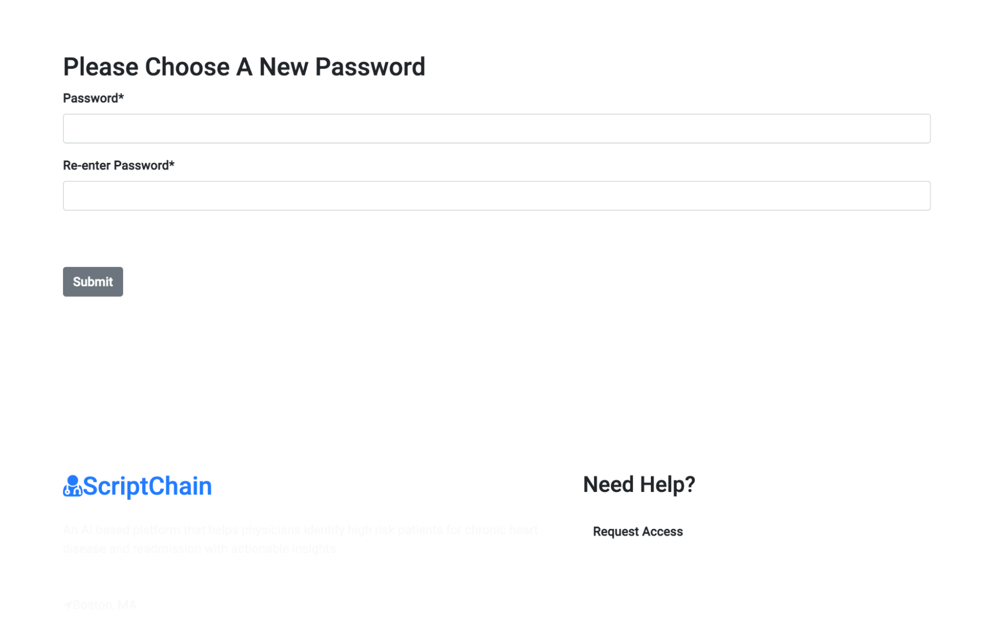
