**How we Code in Angular:**  

1. When creating a new component in angular, we use command:  
ng generate component component-name (replace component-name with the desired name of your component)
2. If this component is a webpage which has its own path, then add the path in "app-routing.module.ts" and include the component folder in head file.
3. If one webpage neads "login" before accessing, then add "HealthcareAuthGuard" or "PatientAuthGuard".
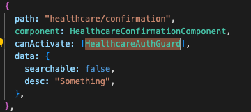    
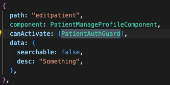
4. Component-based Architecture: Angular follows a component-based architecture, where the application is broken down into reusable and modular components. Each component encapsulates its template, styles, and behavior.
5. Templates: Angular components use HTML templates to define the user interface. You can use Angular's template syntax and data binding features to bind data from the component to the template.
6. Styling: Angular supports various ways of styling, including CSS, SCSS, and other preprocessors. We set styles in .css file.
7. Typescript: Angular applications are primarily written in TypeScript. TypeScript introduces static typing, interfaces, classes, and other features that help catch errors during development and improve code maintainability. We implement our major logic in ".ts" file.
8. Data Binding: Angular supports one-way and two-way data binding. Data binding allows you to establish a connection between the component's data and the template, ensuring that changes in one are reflected in the other.  
eg. We can define a value or function in typescript file and display or call it in html file.     
html:   
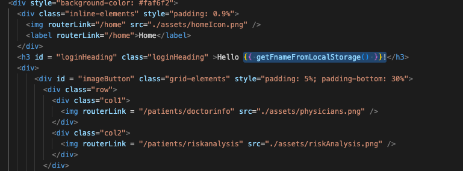      
typescript:  
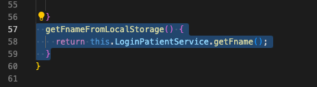
9. About JWT token: When login, we get token from backend, and store token in localstorage (exmaple below are from patient-login component).
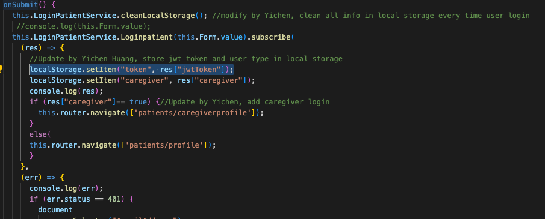   
Everytime we need user information, we can take token from localstorage, send it to backend and get information back. That's how we achieved "login" process.    
get token:   
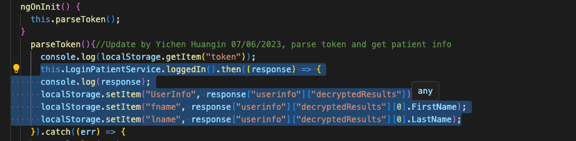   
parse token:   
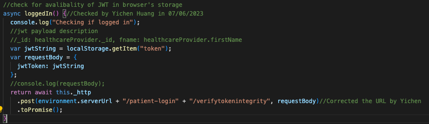

**Things to be done:**

1. The provider sign-up page needs to be redesigned properly as per the user story.
2. The input labels on the become a partner page need to be left justified.
3. The social share buttons on the blog-post page and apply-job page have borders that need to be removed.
4. The send button on the contact us page needs to be centered.
5. Email templates do not show up properly when opened on an email on a web browser. That needs to be fixed.
6. Update graph model for the provider portal with charticulator <https://charticulator.com/index.html>
7. Front end landing-page component: In the typeScript file, the Onsubmit2 function is being called as soon as page is loaded. This is causing null values to be stored in the database. Backend controller: contactUsController. Make OnSubmit function be called upon submit button. Even though its within button parameters in typescript file, its being called every time page is reloaded.
8. Attach partnerships page to database and email api through the partnersController.js . send thank you pop up in onsubmit function in typescript file using toastr notifications.
9. Remove console logging from components if the functionality has been tested and everything works.
10. Fix the blog quotes text for each category, remove the "What __ is saying" template and make each title unique.
11. Organize the html and ts code, make it so the same format is used in similar files, remove unnecessary commented code, integrate imports for repeated functionalities, etc.
13. Integrate Django backend data with frontend patient portal. Make it so a patient ID is passed to backend and corresponding data is sent back.
13. Photo upload for sign up is not working, a photo is uploaded but not accessible.
14. Partnership form and sign up form makes call to backend but the database logging and email sending do not work.
15. Request Access form sends out a contact us email instead of a request access email on the dev environment.
16. # In both patient and provider portals, user needs to login again after 30 minutes whether they are active or not, we need to fix this.
17. Delete duplicate components on angular for webpages

**Important Note:**

1. When using http requests in back end controllers, include the correct headers in the backend
   ie: 
  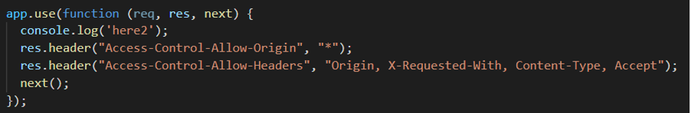

2. When a service file is returning a http request, make sure the typescript controller in angular has a .subscribe() inorder to send the http request to the server.
3. Email Templates don’t send out through new email system
4. Possible fix is to download handlebarJs Package
5. When creating a new component make sure to not add html or body tag, to avoid having duplicates of those tags on the page, which leads to scrolling issues.
6. All links and scripts should belong to the main index.html file 
7. Pem key file should be present in folder with db to access it.
8. Make sure, when trying to access mysql database, to use these credentials: check backend document!
9. When connecting front end component to backend controller, service file is needed as follows: (they are all in the shared folder)
check backend document!
10. Email templates are sent out via handlebars, which just accesses html dynamic web templates and is called via backend controller. Visit contact us controller to see example
11. Scrolling issues may appear as sticky if body head and html tag are stated. Remove these as angular framework automatically includes html tag. Never make CSS on any body html or head with angular. Move all those components to index.html where they can be called throughout the whole program.
12. Everything on database security access information is within the security groups and uses ec2 instance called "bastion host" to bring access to private subnet. So it sets rules from incoming traffic to only be those that have access to ec2 through pem key.
13. **WordPress-Blog-Image** : Make the image responsive on the blog directly on the Wordpress. Step 1: Click the image and click the **Edit as HTML**; Step2: Add the codes ` style="max-width: 100%;height: auto"` to the img tag

A. Responsiveness (Screen size: 300px, 800px, 1030px)
1. Patient portal (all the user stories) needs to be responsive entirely for all the devices except iPhone X.
2. Blog page needs to be responsive for all devices except laptops.
3. Main site ie. Landing pages (Compatibility statement, Faq, Contact Us, Main page, What is ScriptChain, Who we are) are responsive for all the devices
4. Become a partner page needs to be responsive for all the iphone and android devices devices 
5. Healthcare portal needs to be responsive for all the devices except 1030px sizes.

B. Validation is done for healthcare add user module but needs to be done to become a partner page. After the backend is done for the become a partner page other validations like phone number, message can be added. Confirmation email needs to be routed after submitting the request.

C. Connection of Front-end and Back-end once the backend is finished

D. Terms & conditions and Privacy policy components need to be modified according to the new design. Also, the link of both of them should be present under support or About us tabs in the main site wireframe.

E. Reset-password has not been included in any of the wireframes. Help button is present but it’s use is not confirmed whether it’s for forgot password or the customer support links.

  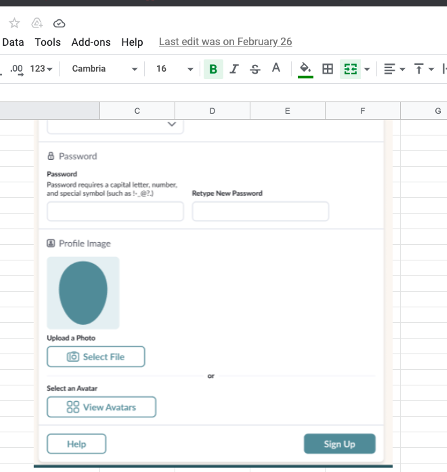

F. Patient portal components (Risk Analysis, Risk Analysis Info, Prescriptions, Medications, Conditions, Lab results, lab result info, procedures and procedure name, Doctor) need to be built and hardcoded.

G. Telesign needs to be connected with the backend and integrated with the add user component under the healthcare module.

**Healthcare Provider Portal**

[**Microsoft graph link](https://charticulator.com/index.html)** 

**Frontend Framework for configuration modules : Gridster for Angular** 

[**https://www.npmjs.com/package/angular-gridster2**](https://www.npmjs.com/package/angular-gridster2)

**Two-step authentication:**

1. In healthcare-login.component.ts, the router needs to be navigated to the location mentioned there. In window.location.href, use whatever EHR is required.
2. This however has to be modified in a way as in when a provider signs in, they enter the EHR system, they have the bond with. We need to route to the EHR system as mentioned.
3. Note: Use Non-production client id for the access of the link
4. On hitting this, we will be seeing a login screen, which needs the provider’s credentials associated with the EHR.
5. The access token which is returned is stored in the backend service called, /storeInCache in the cacheController. With code(available in the url link, appended post successful login) as key and access token as value, the data is stored. 
6. Note: This is essential, since access token is obtained only once and needs to be used for all the requests.
7. /getFromCache is called to fetch the access token based on the code and make requests on behalf of the provider

**JDW - authentication comments:**

1. Step 1 of 5 of the [Standalone Launch flow](https://fhir.epic.com/Documentation?docId=oauth2&section=standaloneOauth2Launch) is implemented in the Angular application. The user is sent to an EHR login screen to gain access. This would give our entire application access to the EHR system via the provider login, which is not what we want. We want system level authorization, independent of the providers.
2. /storeInCache is never called from the Angular app, so no tokens ever make it to Node backend
3. Incomplete implementation (1 of 5 steps): not currently working
4. Authorization flow we need is the [Backend OAuth2 flow](https://fhir.epic.com/Documentation?docId=oauth2&section=BackendOAuth2Guide)

Next steps: Add Oauth flow to Django backend service; remove Oauth flow from Angular app/Node.js backend.

**Components:**

1. **Healthcare-header**

**Route:** healthcare/header

**Description**- Header has ScriptChain logo and user profile image

  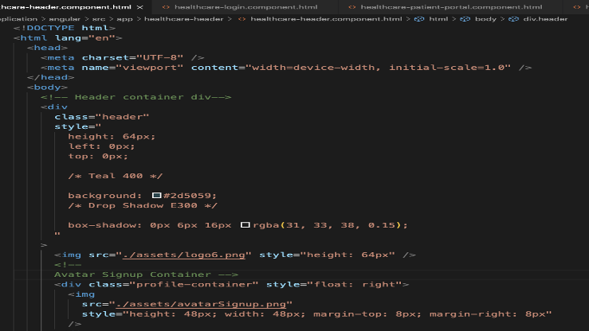

2. **Healthcare-login**

**Route**: healthcare/login

**Description**- Login Component allows users to enter login info email and password so that they can navigate to their own profile. Email and password are present in the form with the validations like email should have @ and .com, both fields are mandatory, email does not exist. Also, it has a link for the patient portal since this is a provider specific login. If the user faces any problem like forgetting password or any other trouble with login, they can use the help button provided in the page. If the user is not registered with Scriptchain they can sign up using the Sign Up button. The button will take them to the next signup component.

Below is the snippet of the code.

  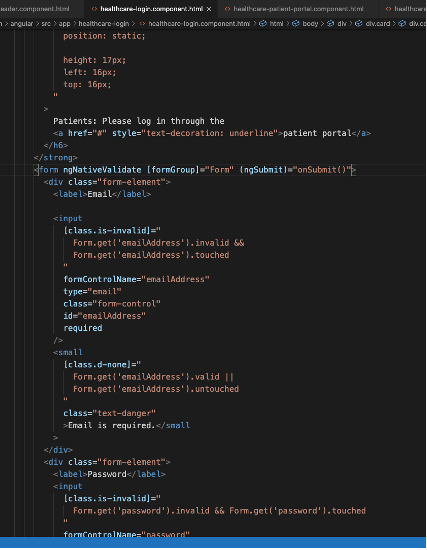

3. **Healthcare-register (Signup)**

**Route:** healthcare/register

**Description**- Sign up component has the fields required by physician to make an account. Below is the list of fields that are required. All the details are present inside the form component along with signup button which will submit the form to create a new account for a physician.

A. Personal Information
	a. First Name
	b. Last Name
	c. Email 
	d. Phone Number
	e. Organisation Name
	f. Position in Organisation
	g. EHR System used

B. Password 
	a.   Password
	b.  Retype new Password

Password has the following rule to create an account;  Password requires a capital letter, number, and special symbol(such as: !,@,?...)

	C. Profile Image- This area of form consists of an option of upload an avatar or image.

There’s a help button if the user faces any problem with signup.

4. **Healthcare-footer**

Route: healthcare/footer

**Description**- Footer has the latest copyright statement of ScriptChain. It can be used in any of the other components.

  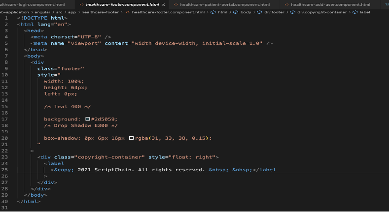

5. **Healthcare-confirmation**

Route: healthcare/confirmation

**Description**- Confirmation component shows that the account creation for the physician was successful and they need to verify their email address as the next step. It also has a help button.

6. **Healthcare-verification**

Route: healthcare/verificationemail

**Description**- The confirmation component is redirected to the verification component. And physicians need to verify their email address using the button present in the page. There’s a link for customer support as well. Here physicians can edit the information if they entered anything w

7. **Healthcare-account-settings**

Route: healthcare/accountsettings

**Description**- Account setting is a component which helps physician to manage their profile details. The fields are same as the Sign up component so the user can edit their information if they made any mistake during the sign up

  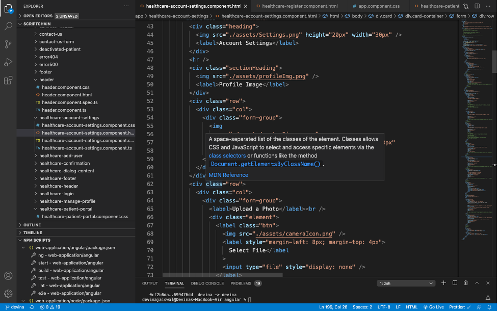

8. **Healthcare-patient-portal**

Route: healthcare/patientportal

**Description**- Patient portal allows physician to give an access to the patient portal. It displays all the patients that are given access which are retrieve from the database with the services. The code will include a *ngFor which will create a new card for each result given from the database. It will navigate to the add patient component.

9. **Healthcare-readmission-risk-info**

Route: healthcare/readmissionriskinfo

**Description**-  This is what should pop up when you click the "Readmission Risk" button, providing additional information, , it is modal which triggers the background being grey 400 translucent

10. **Healthcare-condition-risk-info**

Route: healthcare/conditionriskinfo

**Description**-  This is what should pop up when you click on the name of a condition, providing additional information, it is modal which triggers the background being grey 400 translucent.

  

11. **Healthcare-add-user**

Route: healthcare/adduserpatient

**Description**-  Through this component physician can add the user using the give access to portal button. It has a modal which pops up and ask for the patient or caregiver information like First name, last name,  phone number, relation to the patient. It has different cards for different phases of adding the user. Physicians can navigate using the next and back button. Email and text verification are still yet to be completed.

  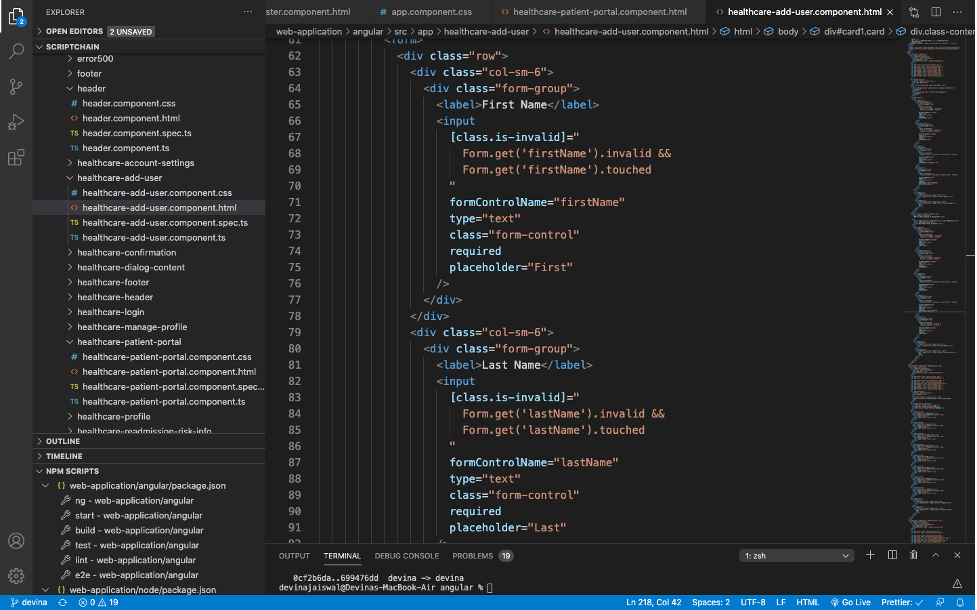

**Landing Page Components**

**Authors and their contributions:**

- **Vidit: Updated the landing page documentation.**

1. **Landing-header**

Route:landing/header

**Description**- Header is divided into 2 parts, left which holds logo, Partnership. Blog, About, Support and contact us, while the right part has the search icon, log in and sign up button.

  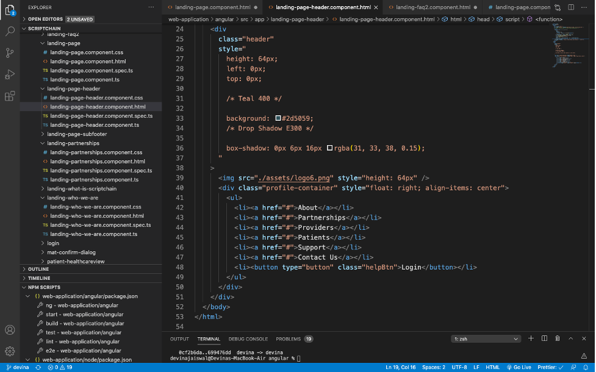

2. **Landing-subfooter**

Route:landing/subfooter

**Description**- Subfooter of the main website has different options to navigate to. Also, it has a copyright statement for 2022. It is mainly divided into 3 parts, the general information with logo and social media, the 3 tables which include all the links such as Partnerships, About and more. The final will be the copyright and terms & conditions. 

  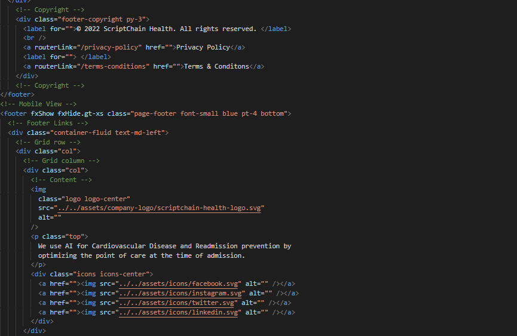

3. **Landing-page**

Route:landing/home

**Description**- This is the main component of the website. It has a header and subfooter component. And in the middle of these two there are cards present which have all the details about the company. Partner descriptions, Data security, Preventive healthcare taglines, and other information.  

  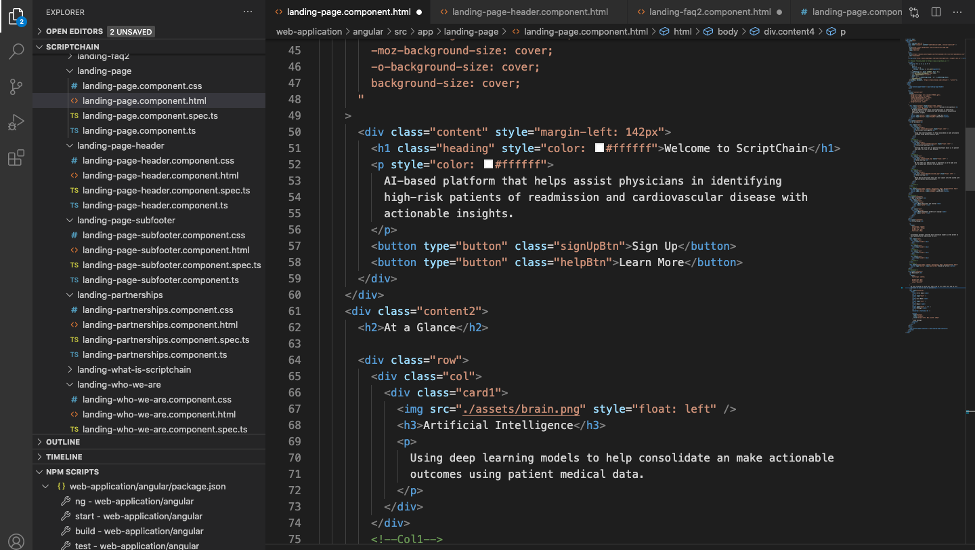

4. **Landing-partnerships**

Route:landing/partnerships

**Description**- In this component details of all the partners are given in the form of a carousel. It includes a button to become a partner.

  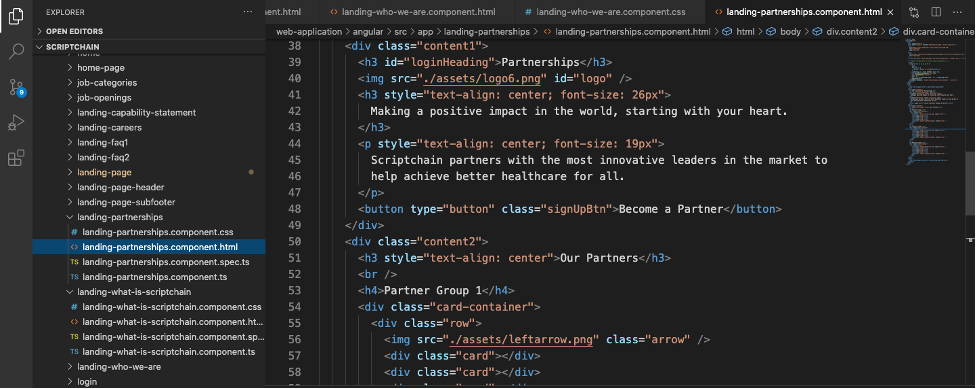

5. **Landing-who-we-are**

Route:landing/whowerare

**Description**- This component consists of all information about ScriptChain CEO and its employees. Employees are divided into 2 categories, the workers and the advisors. All of the employees are shown in a picture with their general information, which if they are clicked are sent to a more specific information for each employee. Information is dynamic with the database.

    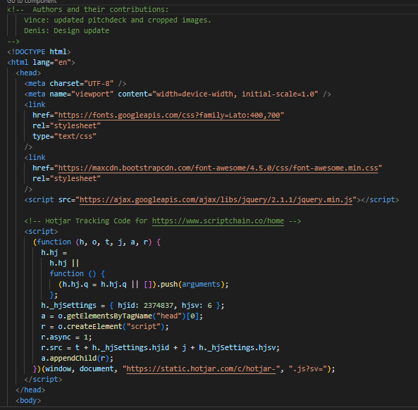

6. **Landing-capability-statement** (Complete)

Route:landing/capabilitystatement

**Description**- In this component capability statements represent. It is a static page which consists of details like-  

	A. Machine Learning / AI / Risk Management
	B. Core Capabilities
	C. Predictive Analytics
	D. Data Integration/ Transfer
	E. Federal Certification
	F. Quasi Government
	G. North American Industry Classification Systtem (NAICS)
	H. General Information
	I. Contact Information
  
  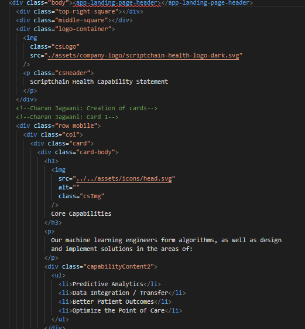

1. **Landing-careers**

Route:landing/careers

**Description**- Careers component has all the list of current job openings. They are divided into categories like Design, Software Development etc. Candidates can click on the apply button and it will navigate to the Angellist page where they can apply for the job.

  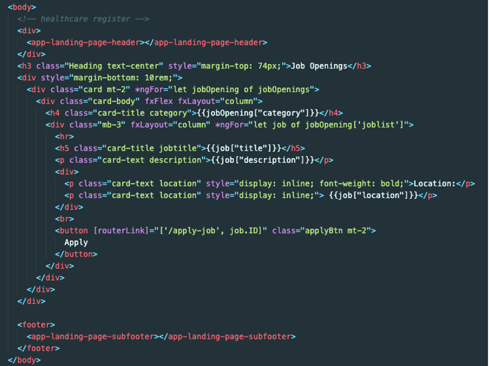

1. **Landing-faq1**

Route:landing/faq

**Description**- Frequently Asked Questions about ScriptChain are present in this component. This is static page which has a list of questions and answers. The information is displayed in form of cards with a read more function.

  

1. **Landing-contact-us**

Route:landing/contact-us

**Description**- This component has a form through which users can contact the ScriptChain customer care executives. The form consists of the following fields-

	A. First Name
	B. Last Name
	C. Email
	D. Message
	E. Send Button

  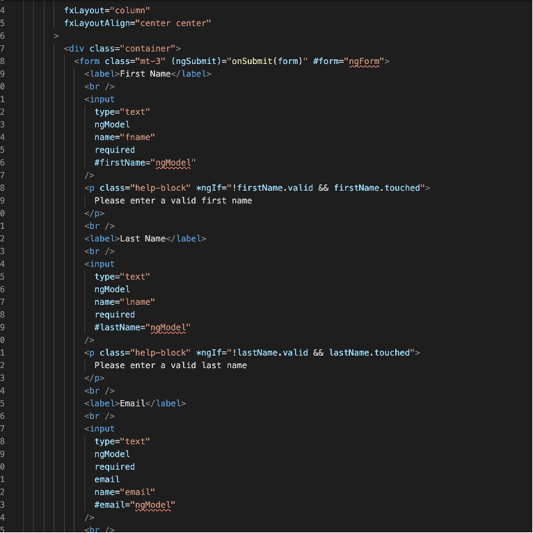

1. **blog**

Route:/blog

**Description**- This component has a list of blog posts that are uploaded to the ScriptChain website. Users can click on the blog cards to read the full blog post and the blog post quote.

  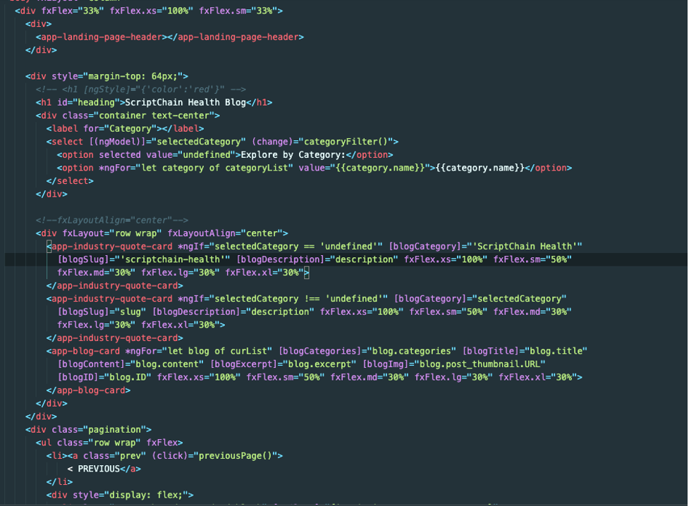

1. **blog-post**

Route: landing/blog-post

Description: This page contains the entire blog post that users can read. They also get to see recommended blog posts beneath the current blog post. They reach this page by clicking on the blog cards on the main blog page. The users can also share this blog post with their family and friends on social media.

  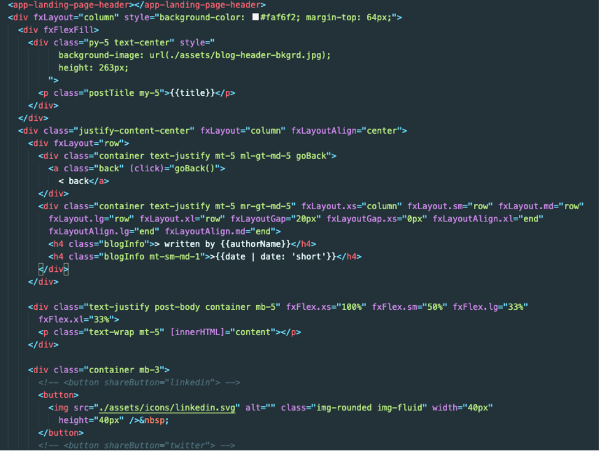

1. **thankyoupartner**

Route: thankyoupartner

**Description**- After submitting a become a partner form users will be navigate to the the thank you page where following information is present.

	A. Thank you for applying to be a ScriptChain partner
	B. We will review our information and do our best to get back to you soon.
	C. Link to the previous become a partner page
	D. Link for the privacy policy

  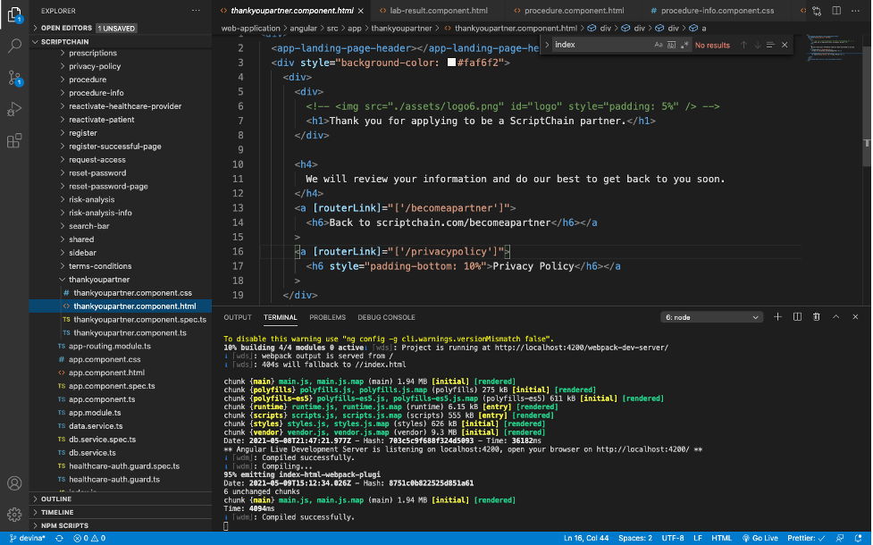

**13. Request Access**
**
`      `Route: /request-access

`      `Description: This page allows users to submit requests to gain access to the ScriptChain platform. There is a form on the page that prompts for the following fields:

	1. First Name
	2. Last Name
	3. Email Address
	4. Type of User: One of Provider, Patient, or Healthcare Worker

  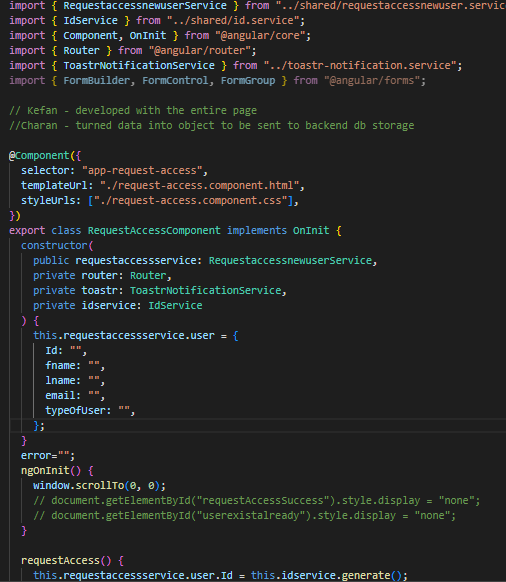
  
14. Who we are (Employees)
      Route: /whoweare/employee/:id
      Description: This is a sub page of who we are. After the users click the employee that they want to learn more information about, it redirects to this page. Holding a lot of information about their background, achievements or anything the employee wants to showcase.

  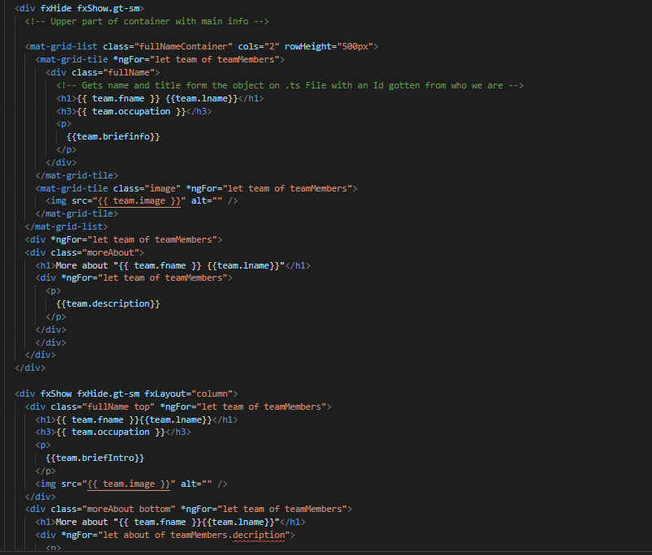
  
 15. Landing Page Carousel
      Route: N/A
      Description: This is a component for the landing page. It holds information and the functionality for the carousel displayed in the bottom of the page. It is made of 4 cards and rotates in 3 cards on web dev and 1 card in the mobile dev.

  
  
  16. Landing Page Header (Menu Dropdown Mobile device)
      Route: N/A
      Description: This is a subpart of the Landing page header. It is only included for mobile and tablet devices, with a length of < 1000px. The main functionality is as the header of mobile devices where users can find it easy to navigate through the website. The menu includes links such as partnership, about, careers and more. On top it has features such as login and signup. The dropdown itself is transparent so users can see the page behind it.

  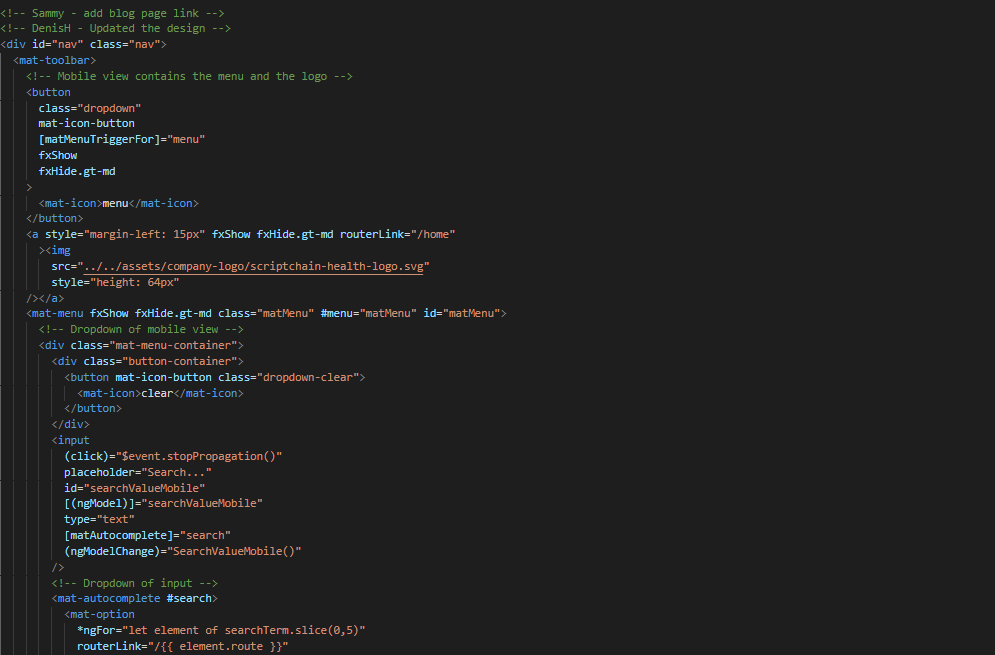

**Patient Portal**

**Components:**

1. **Patient-Signup**

Route: patient/signup

**Description**- Sign up component has the fields required by physician to make an account. Below is the list of fields that are required. All the details are present inside the form component along with signup button which will submit the form to create a new account for a physician.

	a. Email or phone Number
	b. Password

  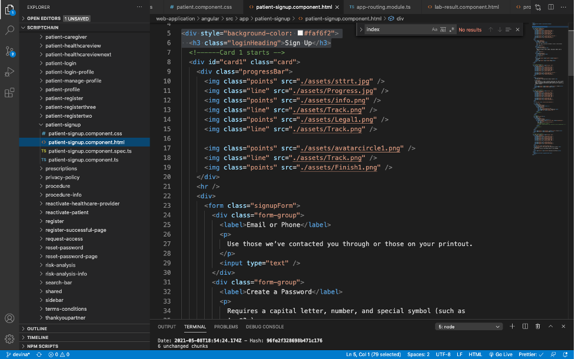
  Greta: the signup component has been updated. The left part is password matching, password encryption, image uploading to S3 buckets.

2. **patient-login**

Route: patient/login

**Description**- Login Component allows users to enter login info email and password so that they can navigate to their own profile. Email and password are present in the form with the validations like email should have @ and .com, both fields are mandatory, email does not exist. Also, it has a link for the patient portal since this is a provider specific login. If the user faces any problem like forgetting password or any other trouble with login, they can use the help button provided in the page. If the user is not registered with Scriptchain they can sign up using the Sign Up button. The button will take them to the next signup component.

Below is the snippet of the code.

  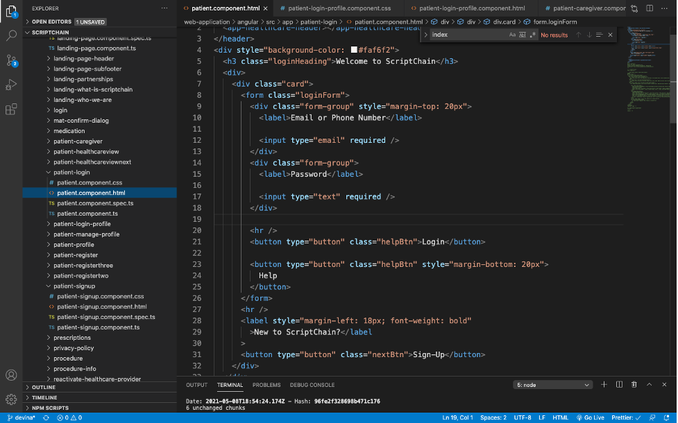

3. **patient-login-profile**

Route: patient/profile

**Description**- After login, patient can view their profile. It consists 4 grid images that can navigate to the respective pages. Below are the details

	A. Physicians
	B. Risk Analysis
	C. Prescriptions
	D. Conditions
	E. Lab Results
	F. Procedures

  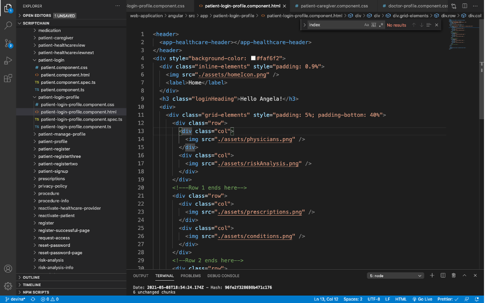

4. **patient-caregiver**

Route: patient/caregiver

**Description**- If any patient is a caregiver then they will get navigated to the caregiver profile which consists of the following data

	A. Doctor
	B. Risk Analysis
	C. Prescriptions
	D. Conditions
	E. Lab Results
	F. Procedures

  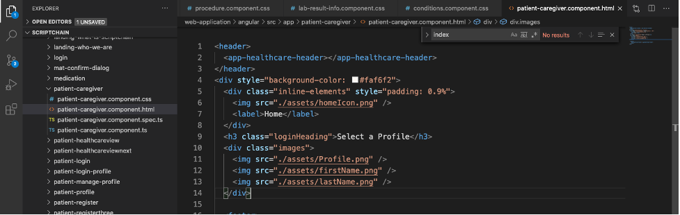

5. **doctor-profile**

Route: patient/doctorinfo

**Description**- Patients can see doctor information in this component like Name, phone number and email.

  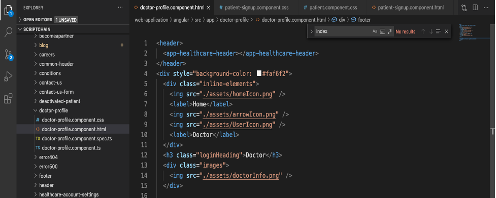

6. **medication**

Route: patient/medication

**Description**- Patients can see medication information like name, dose, date prescribed, physician, directions and specific notes in this module. All the details are present inside the card.

  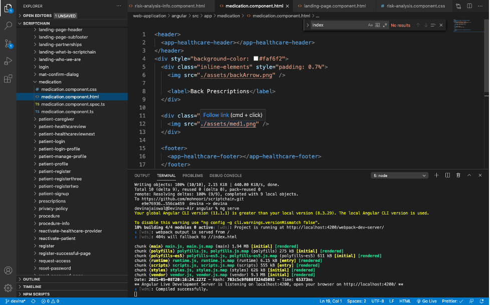

7. **risk-analysis**

Route: patient/riskanalysis

**Description**- Readmission and condition risk are present in this module. Under readmission risk percentage of having cardiovascular are given. There’s an info button for more details. Under condition risk following information is present in the similar fashion.

A. Atrial Fibrillation
B. Coronary Artery Disease
C. Hypertension
D. Heart Failure

  

8. **patient-welcomeemail**

Route: welcomeemail

**Description**- Welcome message is present in this module along with the login button. Customer support info is also there.s

  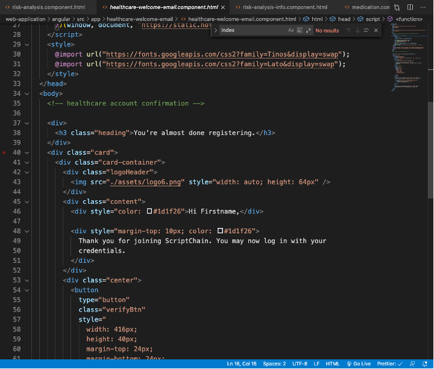

9. **risk-analysis-info**

Route: patient/riskanalysisinfo

**Description**- More information about risk analysis is present in this module. There’s a button to contact the physician. All the information is present inside the card.

  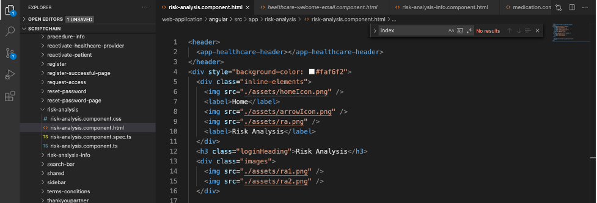

10. **prescriptions**

Route: patient/prescriptions

**Description**- In this module, there are three cards- Medications, Tests and Studies and Past Prescriptions. Medication name and details button are present in the medication card. Test and Studies and Past Prescritption consists of test name and details button

11. **prescription-info**

Route: patient/prescriptioninfo

**Description**- Details about the prescription are given in this module like the dosage and contact physician button.

  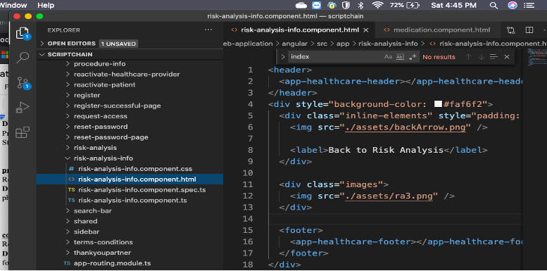

12. **conditions**

Route: patient/conditions

**Description**- This module consists of the conditions that a patient might have. The card has the following information in it-

	A. Condition name
	B. Date diagnosed
	C. Diagnosed by
	D. Contact Physician button

  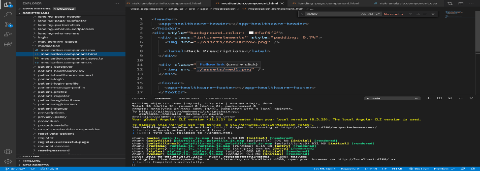

12. **Patient-account-settings**

Route:patient/accountsettings

**Description**- Account setting is a component which helps physician to manage their profile details. The fields are same as the Sign up component so the user can edit their information if they made any mistake during the sign up

  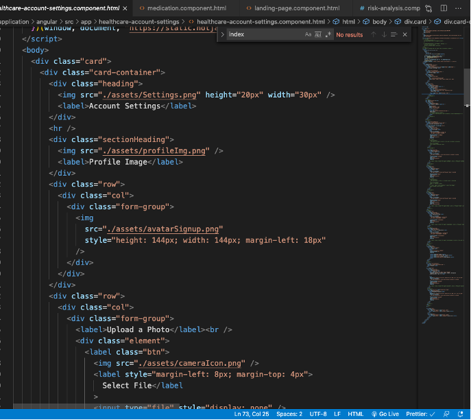

13. **lab -result**

Route:patient/labresults

**Description**- Lab results of patients are present in this module. Date and the result information is present in abnormal and normal format. Details button give the more information about the lab report. Every lab result has a single card.

  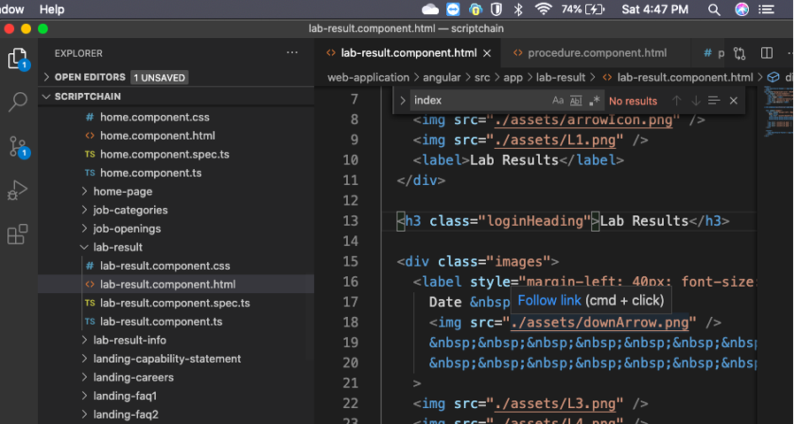

14. **lab -result-info**

Route:patient/labresultsinfo

**Description**- Detailed lab result is present in this card along with the following information.

	A. Test
	B. Result
	C. Contact Physician button
	D. Date Performed

  

15. **procedure**

Route:patient/procedure

**Description**- Every procedure that patient have done is present in this part. Also, the card consists of Procedure name as a heading, date performed and details button for the procedure.

Details button shows the more information about the procedure.

  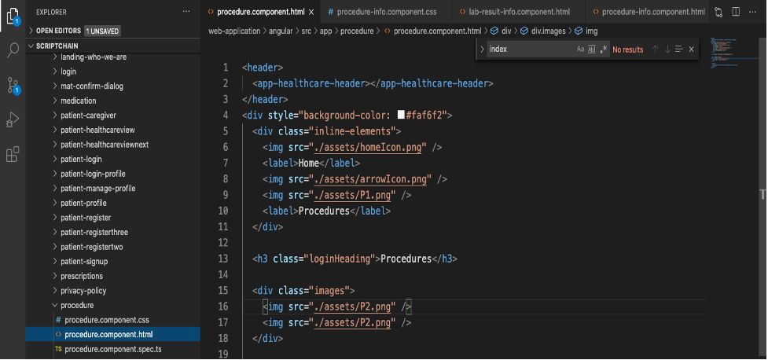

16. **procedure-info**

Route:patient/procedureinfo

**Description**- Detailed information about the procedure is present in this module. It consists of the following information

	A. Procedure name
	B. Date Performed
	C. Performed by
	D. Physician Notes

  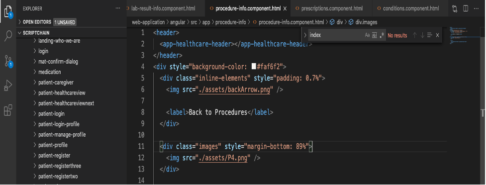

**Components:**

17. **contact-us** (Completed)

**Route:** /contact-us

**Description**- Page dedicated to getting send questions to scriptchainhealth email.

  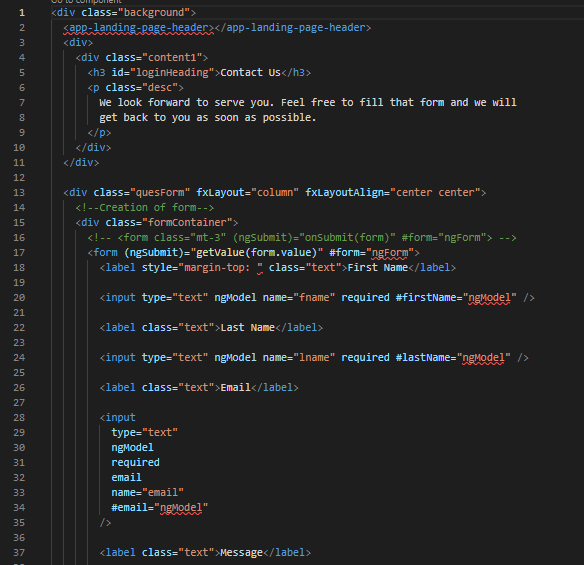
  
18. **employee** (Completed)

**Route:** /whoweare/employee/(numberID)

**Description**- Page dedicated to each personal employee with descriptions

  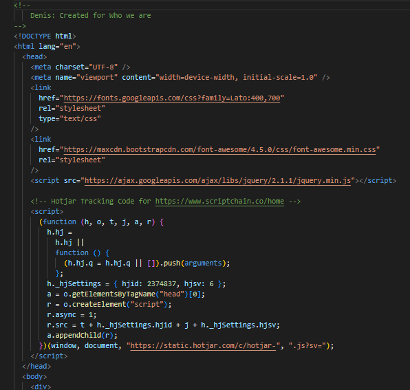

19. **privacy-policy** (Completed)

**Route:** /privacy-policy

**Description**- access to scriptchainhealth's privacy policy

  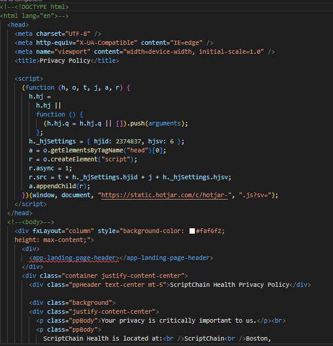
  
20. **terms-conditions** (Completed)

**Route:** /terms-conditions

**Description**- terms and conditions

  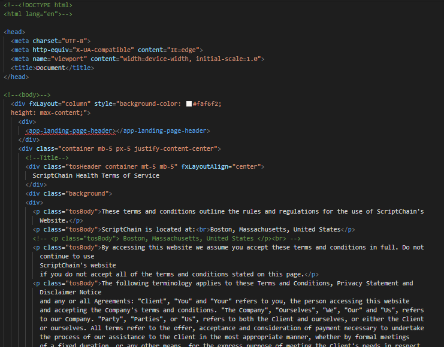

  
21 . **message-bar** 

**Route:** /message-bar 

**Description**- A small UI component that has all messaging funtionality. Funtionality includes:
	1. New messages (plus-sign-icon button) - On click opens a new window that allows user to input message and who they want to send the message too. 
 	2. Collapse (carot icon button) - On click allows user to expand or collapse the messaging tab. When expanded user can see all message history and new messages that they have recievd. When collapse just the messaging tab header is shown 

22. **message-card**

**Route** /message-card

**Description**- Reusable component that is shown when message-bar component is expanded. The car holds a senders profile pic, name, date and message. 

23. **new-message**

**Route** /new-message 

**Description**- Small window that pops up when a user clicks the New message button on the message-bar component. This small window is where a user sends a new message to an intended reciever.  

