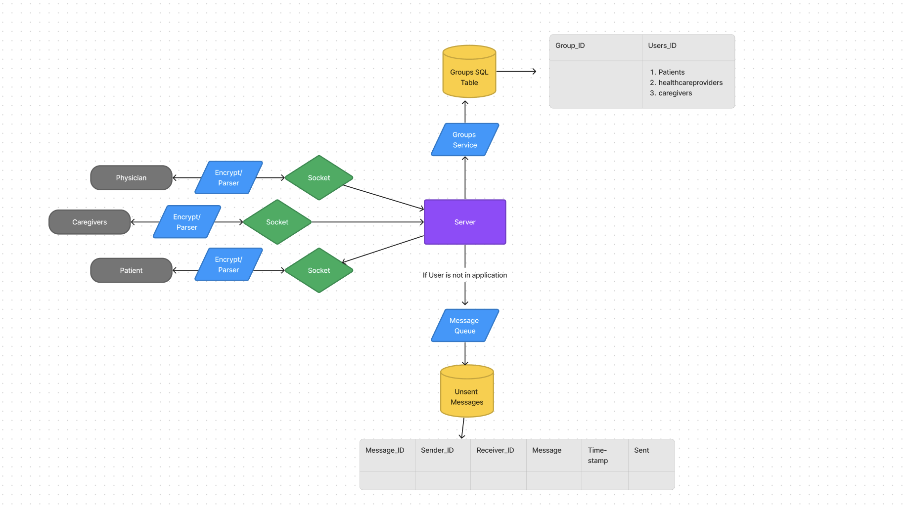

# Messaging System Design 

 

## Overview

### Funtional Requirements 
1. one to one messaging 
2. Group Messaging 
3. End to end encryption 
4. Message status (Delivered)
5. Timestamps 

### Non functional requirements 

1. High avaliabilty 
2. Low latency 
3. Scalable 

### Key Components 

1. Websockets - bidirectional channels between client and server 

2. Encryption and parsing service - Encrypt message and parses it to allow easier server usabiltiy 

3. Server - Handles users request and reconginzes if user is sending chat in one to one communication, group communication. It will serve as a bridge to all other services in the system such as the message queue and socket manager

4. Group Service - A service that is connected to a database that has what users are in what groups. 

5. Message Queue - Whenever a user is sending a message to a user that is not online in the application, the message cannot be sent. Therefore we will store all unsent messages into a database. Once a user comes back online the unsent messages will be sent to that user; and once confirmation of message being deleivered to the user the unsent message will be deleted out of the database. 

6. Socket Manager - Everytime a user is online in the application they will always be connected to a unique socket with a different socket id everytime. To ensure that each user will recieve their messages we will use a database that keeps track of all online users and their respective socket_id. Once a user comes offline the the socket manager will remove that user in the socket manager; and if a user appears back online add again with their new socket_id. 

7. Message History - a database of all sent messages; can use cron to delete messages after a time period in SQL database

### Possible Utilities 

1. Socket Manager: 
    * SQL Database - We already have a RDS mysql database that should be easy to implement. It will never be too big since it will have constant additions and deletions. Cons can be slow retrival time 

    * Redis Cache - Can improve retrieval time, and should not be hard to implement. Can be used on AWS ElasticCache for Redis; however additional cost may be involved. With ElastiCache, you pay only for what you use with no minimum fee. You are charged hourly based on the number of nodes, node type, and pricing model you select. There are no upfront costs or long-term commitments. https://aws.amazon.com/elasticache/pricing/?nc=sn&loc=4 to see price breakdown 

2. Message Queue:
    * SQL Database - Same reasoning as Socket Manager. 

    * NoSQL Database - Much more optimal in performance, since there will be no relational data with the unsent message. The data can be retrieved faster. This database should normally be small since it will always be deleting data as the message is being sent https://aws.amazon.com/documentdb/pricing/ to see price breakdown. 

## System Design 

### End to End Encryption of messages 

To ensure end to end encryption protocols, we will encrypt a users message as soon as they send it. It will only be decrypted once it reaches its intended reciever. This means that in the event of the message being stored in the unsnt messages database or message history database it will be encrypted. This also means that the server will not be able to decrypt the message and view its details

### One to One Messaging

Two clients will be able to communicate with each other using sockets. Once a message is being sent it will be:
1. Encrypted
2. Sent to the server along with sender_id and the reciever_id
3. The Server will then check if both users are located on the socket manager (meaning both users are online)
4.  * If both users are online then the message will be sent to the intended reciever; once the server recieves a response from reciever client that the message has been delievered it will store the message into the message history database 
    * If the reciver is not online the message will be stored into the messaging queue database. Once the reciever returns online the message will be deleivered to the user, and then removed from messaging queue database and placed into message history

### Group Messaging 

Multiple clients will be able to communicate with each other usking sockets. Once a message is sent to the group it will be:

1. Encrypted 
2. Send to Server with sender_id and the group_id 
3. The server will send the group_id information to the groups service that will gather all the users that belong to the group from the database
4. Once all user_id is returned back to server it will send those id to socket manager that will insure all users are online 
5.  * If all users are online the sockets will emit the messages to all user clients. Once server recieves a repsonse that all clients have recieved the messages it will store it into the message history database
    * In the event if one or more users in a group is not online, the message will be moved to the messaging queue. Once one of the user comes back online to the application the message queue will send that message to its respective user, and be removed. There will be the remaining messages left in queue until all users have appeared back online. Once that all of those messages are removed from the messaging queue and the server recieves a delievered response from all users, it will add that message to the message history database.

