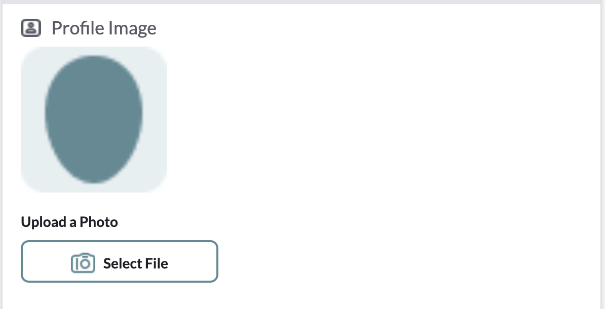
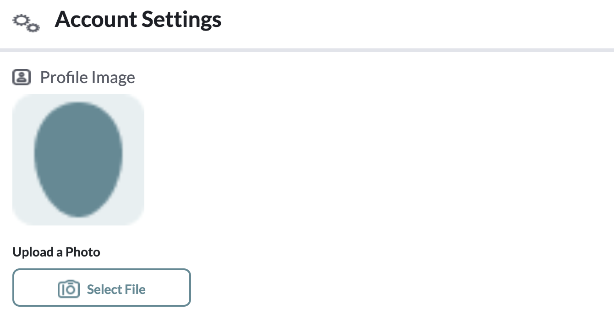
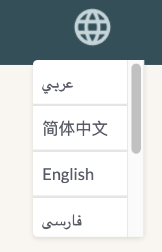
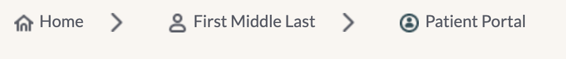

# User Stories Report

Author: Yichen Huang

Date: 08/16/2023

 [User Stories](https://drive.google.com/drive/u/1/folders/14ZZdmiT9JFBu-x7VE3jTUBXgA4v_NSgG) include all the details we need in the process of developing those web pages. This document is to clarify what we still need to do with those uncompleted user stories

---

## Provider Portal

- Signup: Profile Image (not Avatar) stored in database cannot be retrieved properly  
  

- Account Setting: Profile Image (not Avatar) stored in database cannot be retrieved properly  

- Patient Portal: Language translation has not been developed, progress bar on the top is not dynamic  
  
 

- Other userstories marked as Incomplete or In progress in user stories folder: Not dynamic yet

## Patient Portal

- Pages without "Done" is not dynamic yet