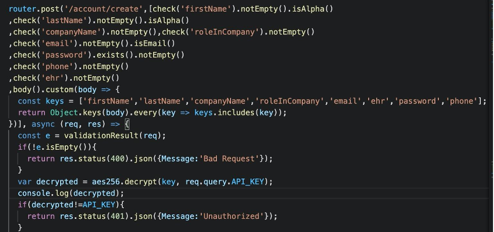
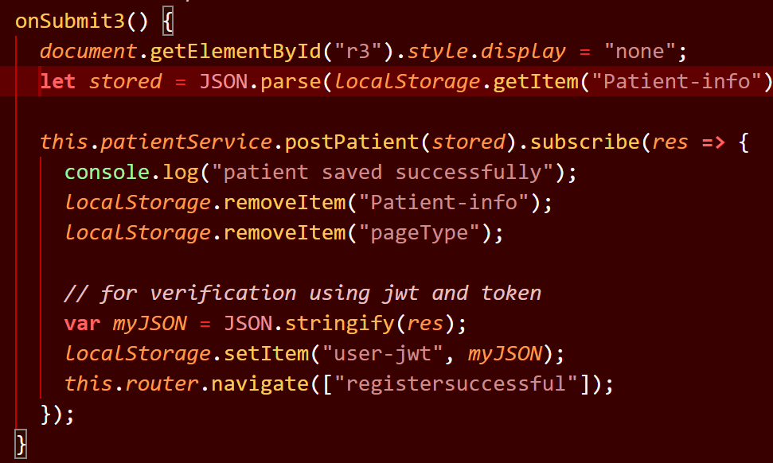

# **Login Documentation**

# Registration Flow

<table>
  <tr>
   <td>FrontEnd
   </td>
   <td>Backend
   </td>
  </tr>
  <tr>
   <td>

Registration   ->

   </td>
   <td>
   </td>
  </tr>
  <tr>
   <td>
   </td>
   <td>&lt;- JWT Token(emailed)
   </td>
  </tr>
  <tr>
   <td>

Verify Token Request ->

   </td>
   <td>
   </td>
  </tr>
  <tr>
   <td>
   </td>
   <td>&lt;- User Successfully created
   </td>
  </tr>
</table>

*	The provided details are posted to ‘/account/create’
 

*	Once the backend validations are satisfied, a verification email will be sent
*	In the ‘/account/verify’ section, jwtToken validation happens

# Registration Process

*   The user fills out the registration form and clicks submit at the end of the third page of registration.
*   Then the following function is executed

    

*   The postPatient http call triggers the Post(‘/patient’) in the backend.
*   It will receive back a JW token that will be stored in local the session storage  as {token, email} pair

Post(‘/patient’)

*   It will check if email is present in the **verified user** collection in the database and will return an error if it already exists.
*   It will then check if the email is present in the **patient** collection in the database and will return an error if it already exists.
*   Then a JWT token is created by using the user object received from the frontend
*   The token is then attached to the ‘/patientlogin?verify=token’ and then an email with that link is sent to the user provided email.
*   Then a random 16 character length alphanumeric token is created
*   A {token,email} pair is saved in the **tokenschema **collection in the database.

When the user clicks the link in the email

/patientlogin?verify=token

*   The token in the url is then decoded to get the body of the user object provided during the registration.
*   The ‘/verified’ endpoint is triggered in the backend.

‘/verified’

*   Then the user email is added to the **verifieduser** collection in the database and the patient object is added to the **patient** collection in the database.
